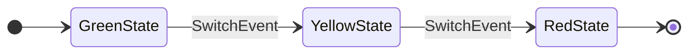

# KStateMachine


[](https://sonarcloud.io/dashboard?id=nsk90_kstatemachine)
[](https://codecov.io/gh/nsk90/kstatemachine)
[](https://central.sonatype.com/artifact/io.github.nsk90/kstatemachine)
[](https://jitpack.io/#nsk90/kstatemachine)
[](https://kstatemachine.github.io/kstatemachine/#multiplatform)

[](https://opencollective.com/kstatemachine)
[](https://github.com/KotlinBy/awesome-kotlin)
[](https://android-arsenal.com/details/1/8276)
[](https://twitter.com/intent/tweet?text=I%20like%20KStateMachine%20library%20%0A%0Ahttps%3A%2F%2Fgithub.com%2Fnsk90%2Fkstatemachine%0A%0A%23kstatemachine)
[](https://www.reddit.com/submit?url=https%3A%2F%2Fgithub.com%2Fnsk90%2Fkstatemachine&title=I%20like%20KStateMachine%20library)


[Documentation](https://kstatemachine.github.io/kstatemachine) | [Quick start](#quick-start-sample) | [Sponsors](#sponsors-) | [Samples](#samples) | [Install](#install) | [Contribution](#contribution) | [License](#license) | [Discussions](https://github.com/nsk90/kstatemachine/discussions)

KStateMachine is a Kotlin DSL library for creating [state machines](https://en.wikipedia.org/wiki/Finite-state_machine)
and [statecharts](https://www.sciencedirect.com/science/article/pii/0167642387900359/pdf).

## Overview

Integration features are:

* **Kotlin [DSL](https://kotlinlang.org/docs/type-safe-builders.html#scope-control-dslmarker) syntax.**
  Declarative and clear state machine structure. Using without DSL is also possible.
* **Kotlin [Coroutines](https://kstatemachine.github.io/kstatemachine/#kotlin-coroutines) support.**
  Call suspendable functions within the library.
  You can fully use KStateMachine without Kotlin Coroutines dependency if necessary.
* **Kotlin [Multiplatform](https://kstatemachine.github.io/kstatemachine/#multiplatform) support.**
* **Zero dependency.** It is written in pure Kotlin, it does not depend on any third party libraries or Android SDK.

State management features:

* **Event based** - [transitions](https://kstatemachine.github.io/kstatemachine/#setup-transitions) are performed by processing
  incoming events
* **[Reactive](https://kstatemachine.github.io/kstatemachine/#listen-states)** - listen for machine, states,
  [state groups](https://kstatemachine.github.io/kstatemachine/#listen-group-of-states) and transitions
* **[Guarded](https://kstatemachine.github.io/kstatemachine/#guarded-transitions)
  and [Conditional transitions](https://kstatemachine.github.io/kstatemachine/#conditional-transitions)** - dynamic target
  state which is calculated in a moment of event processing depending on application business logic
* **[Nested states](https://kstatemachine.github.io/kstatemachine/#nested-states)** - build hierarchical state machines
  (statecharts)
  with [cross-level transitions](https://kstatemachine.github.io/kstatemachine/#cross-level-transitions) support
* **[Composed (nested) state machines.](https://kstatemachine.github.io/kstatemachine/#composed-(nested)-state-machines)** Use
  state machines as atomic child states
* **[Pseudo states](https://kstatemachine.github.io/kstatemachine/#pseudo-states)** for additional logic in machine behaviour
* **[Typesafe transitions](https://kstatemachine.github.io/kstatemachine/#typesafe-transitions)** - pass data in typesafe way
  from event to state
* **[Parallel states](https://kstatemachine.github.io/kstatemachine/#parallel-states)** - avoid a combinatorial explosion of
  states
* **[Undo transitions](https://kstatemachine.github.io/kstatemachine/#undo-transitions)** - navigate back to previous state
* **[Optional argument](https://kstatemachine.github.io/kstatemachine/#optinal-arguments)** passing for events and transitions
* **[Export](https://kstatemachine.github.io/kstatemachine/#export)** state machine structure
  to [PlantUML](https://plantuml.com/) and [Mermaid](https://mermaid.js.org/) diagrams
* **[Logging](https://kstatemachine.github.io/kstatemachine/#logging)** - useful for debugging
* **[Testable](https://kstatemachine.github.io/kstatemachine/#testing)** - run state machine from specified state
* **Well tested** - all features are covered
  by [tests](https://github.com/nsk90/kstatemachine/tree/master/tests/src/commonTest/kotlin/ru/nsk/kstatemachine)

> [!IMPORTANT]
> SEE FULL [DOCUMENTATION HERE](https://kstatemachine.github.io/kstatemachine)

## Quick start sample

### Finishing traffic light



```kotlin

object SwitchEvent : Event

sealed class States : DefaultState() {
    object GreenState : States()
    object YellowState : States()
    object RedState : States(), FinalState // Machine finishes when enters final state
}

fun main() = runBlocking {
    // Create state machine and configure its states in a setup block
    val machine = createStateMachine(this) {
        addInitialState(GreenState) {
            // Add state listeners
            onEntry { println("Enter green") }
            onExit { println("Exit green") }

            // Setup transition
            transition<SwitchEvent> {
                targetState = YellowState
                // Add transition listener
                onTriggered { println("Transition triggered") }
            }
        }

        addState(YellowState) {
            transition<SwitchEvent>(targetState = RedState)
        }

        addFinalState(RedState)

        onFinished { println("Finished") }
    }

    // Now we can process events
    machine.processEvent(SwitchEvent)
    machine.processEvent(SwitchEvent)
}
```

## Sponsors ❤

> [!NOTE]
> Please, push the ⭐ if you like this project

I highly appreciate that you donate or become a sponsor to support the project.
Use ❤️ github-sponsors button to see supported methods.

## Samples

* [Simple Android 2D shooter game sample](https://github.com/nsk90/android-kstatemachine-sample)

  The library itself does not depend on Android.

  <p align="center">
      
  </p>
* [Finished state sample](./samples/src/commonMain/kotlin/ru/nsk/samples/FinishedStateSample.kt)
* [Transition on FinishedEvent sample](./samples/src/commonMain/kotlin/ru/nsk/samples/FinishedEventSample.kt)
* [FinishedEvent using with DataState sample](./samples/src/commonMain/kotlin/ru/nsk/samples/FinishedEventDataStateSample.kt)
* [Undo transition sample](./samples/src/commonMain/kotlin/ru/nsk/samples/UndoTransitionSample.kt)
* [PlantUML nested states export sample](./samples/src/commonMain/kotlin/ru/nsk/samples/PlantUmlExportSample.kt)
* [Mermaid nested states export sample](./samples/src/commonMain/kotlin/ru/nsk/samples/MermaidExportSample.kt)
* [PlantUML with MetaInfo export sample](./samples/src/commonMain/kotlin/ru/nsk/samples/PlantUmlExportWithMetaInfoSample.kt)
* [Inherit transitions by grouping states sample](./samples/src/commonMain/kotlin/ru/nsk/samples/InheritTransitionsSample.kt)
* [Minimal sealed classes sample](./samples/src/commonMain/kotlin/ru/nsk/samples/MinimalSealedClassesSample.kt)
* [Usage without Kotlin Coroutines sample](./samples/src/commonMain/kotlin/ru/nsk/samples/StdLibMinimalSealedClassesSample.kt)
* [Minimal syntax sample](./samples/src/commonMain/kotlin/ru/nsk/samples/MinimalSyntaxSample.kt)
* [Guarded transition sample](./samples/src/commonMain/kotlin/ru/nsk/samples/GuardedTransitionSample.kt)
* [Cross-level transition sample](./samples/src/commonMain/kotlin/ru/nsk/samples/CrossLevelTransitionSample.kt)
* [Typesafe transition sample](./samples/src/commonMain/kotlin/ru/nsk/samples/TypesafeTransitionSample.kt)
* [Complex syntax sample](./samples/src/commonMain/kotlin/ru/nsk/samples/ComplexSyntaxSample.kt)
  shows many syntax variants and library possibilities, so it looks messy

## Install

KStateMachine is available on `Maven Central` and `JitPack` repositories.

See [install section in the docs](https://kstatemachine.github.io/kstatemachine/#install) for details.

### Maven Central

```kotlin
dependencies {
    // multiplatform artifacts, where <Tag> is a library version.
    implementation("io.github.nsk90:kstatemachine:<Tag>")
    implementation("io.github.nsk90:kstatemachine-coroutines:<Tag>")
}
```

## Build

Run `./gradlew build` or build with `Intellij IDEA`.

## Contribution

The library is in a active development phase. You are welcome to propose useful features and contribute to the project.
See [CONTRIBUTING](./CONTRIBUTING.md) file.

## Thanks to supporters

[](https://github.com/nsk90/kstatemachine/stargazers)
[](https://github.com/nsk90/kstatemachine/network/members)

## License

Licensed under permissive [Boost Software License](./LICENSE)