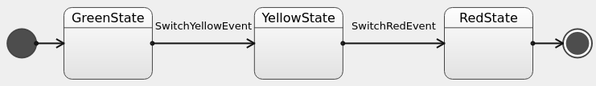

# KStateMachine


[](https://sonarcloud.io/dashboard?id=nsk90_kstatemachine)

KStateMachine is a Kotlin DSL library for creating finite state
machines [FSM](https://en.wikipedia.org/wiki/Finite-state_machine) and listen to its states and
transitions changes to perform side effects.

## How to build

Use Gradle wrapper to build project:

```bash
./gradlew build
```

Resulting `kstatemachine-*.jar` where `*` is version, is located
at `<project_root>/kstatemachine/build/libs/`

## Overview

Main features are:

* Kotlin DSL syntax for defining state machine structure;
* Conditional transitions, when target state is dynamic and is calculated in a moment of event
  processing depending on application business logic;
* Argument passing for events and transitions;
* Export state machine structure to [Graphviz](https://graphviz.org/).

_The library is currently in a development phase. You are welcome to propose useful features._

Building blocks (main classes) of this library:

* `StateMachine` - is a collection of states and transitions between them, processes events when
  started;
* `State` - states where state machine can go to;
* `Event` - is a base class for events or other words actions which are processed by state machine
  and may trigger transitions;
* `Transition` - is an operation of moving from one state to another.

Working with state machine consists of two steps:

* Creation and initial setup, here you may set custom actions (side effects) via listeners to be
  performed on entering/exiting states and transitions between them;
* Processing events, on which state machine can switch its states and notify about changes.

```kotlin
val stateMachine = createStateMachine {
    // Setup is made in this block ...
}
// After setup it is ready to process events
stateMachine.processEvent(SwitchGreenEvent)
// ...
stateMachine.processEvent(SwitchYellowEvent)
```

## Finishing traffic light sample



```kotlin
// Define events
object YellowEvent : Event
object RedEvent : Event

fun main() {
    // Create state machine and configure its states in a setup block
    val stateMachine = createStateMachine {
        // State machine finishes when enters final state
        val redState = finalState()

        val yellowState = state {
            // Setup transition on RedEvent
            transition<RedEvent> {
                targetState = redState
                // Add transition listener
                onTriggered { println("Transition on ${it.event}") }
            }
        }

        initialState {
            // Add state listeners
            onEntry { println("Enter $name state") }
            onExit { println("Exit $name state") }

            transition<YellowEvent> { targetState = yellowState }
        }
    }

    // Process events
    stateMachine.processEvent(YellowEvent)
    stateMachine.processEvent(RedEvent)
}
```

## Create state machine

First we create a state machine with `createStateMachine()` function:

```kotlin
val stateMachine = createStateMachine(
    "Traffic lights" // Optional name is convenient for logging debugging and export
) {
    // Set up state machine ...
}
```

## Setup states

In state machine setup block we define states with `state()` function and set initial one
with `setInitialState()`:

```kotlin
createStateMachine {
    // Use state() function to create State and add it to StateMachine
    val greenState = state()
    // State name is optional and is useful to getting state instance
    // after state machine setup and for debugging
    val yellowState = state("Yellow")

    // State machine enters this state after setup is complete
    setInitialState(greenState)
}
```

You can use `initialState()` and `addInitialState()` shortcut functions to create/add and set
initial state:

```kotlin
createStateMachine {
    val greenState = initialState("Green")
    //...
}
```

You can use `State` subclasses with `addState()` and `addInitialState()` functions:

```kotlin
object SomeState : DefaultState()

createStateMachine {
    val someState = addState(SomeState())
    //...
}
```

In state setup blocks we can add listeners for states:

```kotlin
state {
    onEntry { println("Enter $name state") }
    onExit { println("Exit $name state") }
}
```

Or even shorter:

```kotlin
state().onEntry { /*...*/ }
```

## Setup transitions

When we have multiple states we should say for each one, which events will trigger transitions to
another states:

```kotlin
greenState {
    // Setup transition which is triggered on SwitchYellowEvent
    transition<SwitchYellowEvent> {
        // Set target state where state machine go when this transition if performed
        targetState = yellowState
    }
}
```

_Note: only one transition is possible per event type. This means you cannot have multiple
transitions parametrized with same `Event` subclass._

Transition may have no target state (`targetState` is null) which means that state machine stays in
current state when such transition triggers:

```kotlin
greenState {
    transition<SwitchYellowEvent>()
}
```

Same as for states we can listen to transition triggering:

```kotlin
transition<SwitchYellowEvent> {
    targetState = yellowState
    onTriggered { println("Transition to $targetState is triggered by ${it.event}") }
}
```

There might be many transitions from one state to another. It is possible to listen to all of them
in state machine setup block:

```kotlin
createStateMachine {
    //...
    onTransition { sourceState, targetState, event, argument ->
        // Listen to every performed transition here
    }
}
``` 

## Conditional transitions

State machine becomes more powerful tool when you can choose target state depending on your business
logic (some external state).

There are three options in choosing direction of next state:

* `stay` - in this case transition is triggered but state is not changed;
* `targetState` - transition is triggered and state machine goes to a specified state;
* `noTransition` - transition is not triggered.

To use conditional transitions you pass a lambda into `transitionConditionally()` function which
makes desired decision:

```kotlin
redState {
    // A conditional transition helps to control when it 
    // should be triggered and determine its target state
    transitionConditionally<SwitchGreenEvent> {
        direction = {
            // Suppose you have a function returning some 
            // business logic value which may differ
            fun getCondition() = 0

            when (getCondition()) {
                0 -> targetState(greenState)
                1 -> targetState(yellowState)
                2 -> stay()
                else -> noTransition()
            }
        }
    }
    // Same as before you can listen when conditional transition is triggered
    onTriggered { println("Conditional transition is triggered") }
}
```

## Logging

You can enable internal state machine logging on your platform:

```kotlin
createStateMachine {
    //...
    logger = StateMachine.Logger {
        println(it)
    }
}
```

## Error handling

By default, state machine simply ignores events that does not match any defined transition. You can
see those events if logging is enabled or use custom `IgnoredEventHandler`:

```kotlin
createStateMachine {
    //...
    ignoredEventHandler = StateMachine.IgnoredEventHandler { _, event, _ ->
        error("unexpected $event")
    }
}
```

It is not allowed to call `processEvent()` while state machine is already processing event. For
example from notification listener. By default, state machine will throw exception in this case, but
you can set custom `PendingEventHandler`:

```kotlin
createStateMachine {
    //...
    pendingEventHandler = StateMachine.PendingEventHandler { pendingEvent, _ ->
        error(
            "$this can not process pending $pendingEvent " +
                    "as event processing is already running. " +
                    "Do not call processEvent() from notification listeners."
        )
    }
}
```

## Finishing state machine

Some of state machines are infinite, but other ones may finish. State machine that was finished
stops to process incoming events. To make state machine finishing, add `FinalState` to it
with `finalState()` function or add any subclass of `FinalState` with `addState()` function. State
machine finishes when enters `FinalState` and notifies its listeners with `onFinished()` callback.

```kotlin
createStateMachine {
    final = finalState("final")
    setInitialState(final)

    onFinished { println("State machine is finished") }
}
```

_Note: `FinalState` can not have transitions._

## Arguments

_Note: Type of arguments is `Any?`, so it is not type safe ot use them._

### Event argument

Usually if event may hold some data we define Event subclass, it is type safe. Sometimes if data is
optional it may be simpler to use event argument. You can specify arbitrary argument with an event
in `processEvent()` function. Then you can get this argument in state and transition listeners.

```kotlin
val stateMachine = createStateMachine {
    state("offState").onEntry {
        println("Event ${it.event} argument: ${it.argument}")
    }
    //...
}
// Pass argument with event
stateMachine.processEvent(TurnOn, 42)
```

### Transition argument

If transition listener produce some data, you can pass it to target state as a transition argument:

```kotlin
val second = state("second").onEntry {
    println("Transition argument: ${it.transition.argument}")
}
state("first") {
    transition<SwitchEvent> {
        targetState = second
        onTriggered { it.transition.argument = 42 }
    }
}
```

_Note: it is up to user to control that argument field is set from one listener. You can use some
mutable data structure and fill it from multiple listeners._

## Multi threading

State machine is designed to work in single thread. So if you need to process events from different
threads you can post them to some thread safe queue and start single thread which will pull events
from that queue in a loop and call `processEvent()` function.

## Export to Graphviz

Graphviz uses [DOT language](https://graphviz.org/doc/info/lang.html) to visualize graphs.
Use `exportToDot()` extension function to export state machine to DOT language.

```kotlin
val stateMachine = createStateMachine {
    // ...
}

val dot = stateMachine.exportToDot()
println(dot)
```

Copy/paste resulting output to any tool supporting DOT language, for example:
* https://dreampuf.github.io/GraphvizOnline/
* http://magjac.com/graphviz-visual-editor/

_Note: conditional transitions depending on external data might not work._

## Do not

State machine is a powerful tool to control states so let it do its job, do not select target state
by sending different event types depending on business logic state, let the state machine to make
decision for you.

Wrong:

```kotin
if (somethingHappend)
    stateMachine.processEvent(FirstEvent)
else 
    stateMachine.processEvent(SecondEvent)
```

Correct - let the state machine to make decisions on an event:

```kotin
stateMachine.processEvent(SomethingHappenedEvent)
```

## Samples

This sample shows different syntax variants and library possibilities in one place, so it looks
messy.

[Full syntax sample](./samples/src/main/kotlin/ru/nsk/samples/FullSyntaxSample.kt)

## License

[MIT License](./LICENSE)