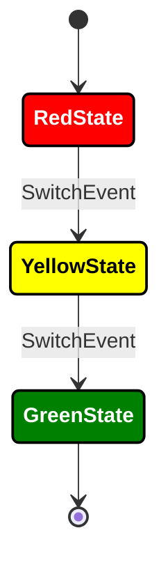

# KStateMachine


[](https://sonarcloud.io/dashboard?id=nsk90_kstatemachine)
[](https://codecov.io/gh/nsk90/kstatemachine)
[](https://central.sonatype.com/artifact/io.github.nsk90/kstatemachine)
[](https://jitpack.io/#nsk90/kstatemachine)
[](https://kstatemachine.github.io/kstatemachine/#multiplatform)

[](https://opencollective.com/kstatemachine)
[](https://jb.gg/OpenSourceSupport)
[](https://github.com/KotlinBy/awesome-kotlin)
[](https://android-arsenal.com/details/1/8276)
[](https://twitter.com/intent/tweet?text=I%20like%20KStateMachine%20library%20%0A%0Ahttps%3A%2F%2Fgithub.com%2Fkstatemachine%2Fkstatemachine&hashtags=kstatemachine,kotlin,opensource)
[](https://www.reddit.com/submit?url=https%3A%2F%2Fgithub.com%2Fkstatemachine%2Fkstatemachine&title=I%20like%20KStateMachine%20library)
[](https://kotlinlang.slack.com/archives/C07DVAEKLM8)


**[Documentation](https://kstatemachine.github.io/kstatemachine) |
[KDoc](https://kstatemachine.github.io/kstatemachine/kdoc/index.html) |
[Sponsors](#-sponsors) |
[Quick start](#-quick-start-sample) |
[Samples](#-samples) |
[Install](#-install) |
[Contribution](#-contribution) |
[Support](#-support) |
[Roadmap](#-roadmap) |
[License](#-license) |
[Discussions](https://github.com/kstatemachine/kstatemachine/discussions)**

**KStateMachine** is a powerful **Kotlin Multiplatform** library with clean DSL syntax for creating
complex [state machines](https://en.wikipedia.org/wiki/Finite-state_machine)
and [statecharts](https://www.sciencedirect.com/science/article/pii/0167642387900359/pdf) driven by 
**Kotlin Coroutines**.

## 🌏 Overview

### 📦 Integration features

* **[Kotlin DSL](https://kotlinlang.org/docs/type-safe-builders.html#scope-control-dslmarker) syntax** -
  declarative and clear state machine structure. Using without DSL is also possible.
* **[Kotlin Coroutines](https://kstatemachine.github.io/kstatemachine/pages/multithreading.html#kotlin-coroutines)
  support** -
  call suspendable functions within the library.
  You can fully use KStateMachine without Kotlin Coroutines dependency if necessary.
* **[Kotlin Multiplatform](https://kstatemachine.github.io/kstatemachine/pages/multiplatform.html) support**
* **Zero dependency** - it is written in pure Kotlin, main library artifact does not depend on any third party libraries
  or Android SDK.

### ⚙️ State management features

* **[Event based](https://kstatemachine.github.io/kstatemachine/pages/events.html)** - [transitions](https://kstatemachine.github.io/kstatemachine/pages/transitions/transitions.html) are performed by
  processing
  incoming events
* **[Reactive](https://kstatemachine.github.io/kstatemachine/pages/states/states.html#listen-states)** - listen for
  machine, states,
  [state groups](https://kstatemachine.github.io/kstatemachine/pages/states/states.html#listen-group-of-states) and
  transitions
* **[Guarded](https://kstatemachine.github.io/kstatemachine/pages/transitions/transitions.html#guarded-transitions)
  and [Conditional transitions](https://kstatemachine.github.io/kstatemachine/pages/transitions/transitions.html#conditional-transitions)** - dynamic
  target
  state which is calculated in a moment of event processing depending on application business logic
* **[Nested states](https://kstatemachine.github.io/kstatemachine/pages/states/states.html#nested-states)** - build
  hierarchical state machines
  (statecharts)
  with [cross-level transitions](https://kstatemachine.github.io/kstatemachine/pages/transitions/transitions.html#cross-level-transitions)
  support
* **[Composed (nested) state machines](
  https://kstatemachine.github.io/kstatemachine/pages/states/states.html#composed-nested-state-machines
  )** - use state machines as atomic child states
* **[Pseudo states](https://kstatemachine.github.io/kstatemachine/pages/states/pseudo_states.html)** for additional
  logic in machine
  behaviour
* **[Typesafe transitions](https://kstatemachine.github.io/kstatemachine/pages/transitions/typesafe_transitions.html)** - pass data in
  typesafe way
  from event to state
* **[Parallel states](https://kstatemachine.github.io/kstatemachine/pages/states.html#parallel-states)** - avoid a
  combinatorial
  explosion of
  states
* **[Undo transitions](https://kstatemachine.github.io/kstatemachine/pages/transitions/transitions.html#undo-transitions)** - navigate back to previous
state (like stack based FSMs do)

* **[Optional argument](https://kstatemachine.github.io/kstatemachine/pages/events.html#event-argument)** passing for
  events and
  transitions
* **[Export](https://kstatemachine.github.io/kstatemachine/pages/export.html)** state machine structure
  to [PlantUML](https://plantuml.com/) and [Mermaid](https://mermaid.js.org/) diagrams
* **[Persist (serialize)](https://kstatemachine.github.io/kstatemachine/pages/persistence.html)** state machine's
  active
  configuration and restore it later. Built-in `kotlinx.serialization` support.
* **[Testable](https://kstatemachine.github.io/kstatemachine/pages/testing.html)** - run state machine from specified
  state and enable internal logging
* **[Well tested](https://github.com/kstatemachine/kstatemachine/tree/master/tests/src/commonTest/kotlin/ru/nsk/kstatemachine)** - all features are covered
by tests

## 📄 Documentation

> [!IMPORTANT]
> * See full documentation on [website](https://kstatemachine.github.io/kstatemachine)
> * [KDoc for classes](https://kstatemachine.github.io/kstatemachine/kdoc/index.html)

## ❤️ Sponsors

I highly appreciate that you donate or become a sponsor to support the project.
If you find this project useful you can support it by:

* Pushing the ⭐ star-button
* Using ❤️github-sponsors button to see supported donation methods

## 🚀 Quick start sample

### 🚦Finishing traffic light



```kotlin
// define your Events
object SwitchEvent : Event

// define your States as classes or objects
sealed class States : DefaultState() {
    object RedState : States()
    object YellowState : States()

    // machine finishes when enters [FinalState]
    object GreenState : States(), FinalState
}

fun main() = runBlocking {
    // create state machine and configure its structure in a setup block
    val machine = createStateMachine(scope = this) {
        addInitialState(RedState) {
            // add state listeners
            onEntry {
                println("Enter red")
                // you can call suspendable code if necessary
                delay(10)
            }
            onExit { println("Exit red") }

            // setup transition
            transition<SwitchEvent> {
                targetState = YellowState
                // add transition listener
                onTriggered { println("Transition triggered") }
            }
        }

        addState(YellowState) {
            transition<SwitchEvent>(targetState = GreenState)
        }

        addFinalState(GreenState)

        onFinished { println("Finished") }
    }
    // you can observe state machine changes using [Flow] along with simple listeners
    val statesFlow = machine.activeStatesFlow()

    // you can process events after state machine has been started even from listener callbacks
    machine.processEvent(SwitchEvent) // machine goes to [YellowState]
    machine.processEvent(SwitchEvent) // machine goes to [GreenState]
}
```

## 🧪 Samples

* [Android 2D shooter game sample](https://github.com/kstatemachine/android-kstatemachine-sample)

  The library itself does not depend on Android.

  <p align="center">
      
  </p>
* [Compose 2D shooter game sample](https://github.com/KStateMachine/compose-kstatemachine-sample)
* [Finished state sample](./samples/src/commonMain/kotlin/ru/nsk/samples/FinishedStateSample.kt)
* [Transition on FinishedEvent sample](./samples/src/commonMain/kotlin/ru/nsk/samples/FinishedEventSample.kt)
* [FinishedEvent using with DataState sample](./samples/src/commonMain/kotlin/ru/nsk/samples/FinishedEventDataStateSample.kt)
* [Undo transition sample](./samples/src/commonMain/kotlin/ru/nsk/samples/UndoTransitionSample.kt)
* [PlantUML nested states export sample](./samples/src/commonMain/kotlin/ru/nsk/samples/PlantUmlExportSample.kt)
* [Mermaid nested states export sample](./samples/src/commonMain/kotlin/ru/nsk/samples/MermaidExportSample.kt)
* [PlantUML with MetaInfo export sample](./samples/src/commonMain/kotlin/ru/nsk/samples/PlantUmlExportWithMetaInfoSample.kt)
* [Inherit transitions by grouping states sample](./samples/src/commonMain/kotlin/ru/nsk/samples/InheritTransitionsSample.kt)
* [Minimal sealed classes sample](./samples/src/commonMain/kotlin/ru/nsk/samples/MinimalSealedClassesSample.kt)
* [Usage without Kotlin Coroutines sample](./samples/src/commonMain/kotlin/ru/nsk/samples/StdLibMinimalSealedClassesSample.kt)
* [Minimal syntax sample](./samples/src/commonMain/kotlin/ru/nsk/samples/MinimalSyntaxSample.kt)
* [Guarded transition sample](./samples/src/commonMain/kotlin/ru/nsk/samples/GuardedTransitionSample.kt)
* [Cross-level transition sample](./samples/src/commonMain/kotlin/ru/nsk/samples/CrossLevelTransitionSample.kt)
* [Typesafe transition sample](./samples/src/commonMain/kotlin/ru/nsk/samples/TypesafeTransitionSample.kt)
* [Event recording sample](./samples/src/commonMain/kotlin/ru/nsk/samples/SerializationEventRecordingSample.kt)
* [Complex syntax sample](./samples/src/commonMain/kotlin/ru/nsk/samples/ComplexSyntaxSample.kt)
  shows many syntax variants and library possibilities, so it looks messy

## 💾 Install

KStateMachine is available on `Maven Central` and `JitPack` repositories.

See [install section in the docs](https://kstatemachine.github.io/kstatemachine/pages/install.html) for details.

### Maven Central

```kotlin
dependencies {
    // multiplatform artifacts, where <Tag> is a library version.
    implementation("io.github.nsk90:kstatemachine:<Tag>")
    implementation("io.github.nsk90:kstatemachine-coroutines:<Tag>")
    implementation("io.github.nsk90:kstatemachine-serialization:<Tag>")
}
```

## 🏗️ Build

Run `./gradlew build` or build with `Intellij IDEA`.

## 🤝 Contribution

The library is in development phase. You are welcome to propose useful features and contribute to the project.
See [CONTRIBUTING](./CONTRIBUTING.md) file.

## 🙋 Support

I am open to answer you questions and feature requests. Fill free to use any of communication channels to
give your feedback.

* [Slack channel](https://kotlinlang.slack.com/archives/C07DVAEKLM8) or
  [GitHub discussions](https://github.com/kstatemachine/kstatemachine/discussions) - best for questions and discussions
* [GitHub issues](https://github.com/KStateMachine/kstatemachine/issues) - best for bugs and feature requests

If you use some other platforms to ask questions or mention the library, I recommend adding a <ins>link</ins> to this
GitHub project or using `#kstatemachine` tag.

## 🗺️ Roadmap

* Make publication about using state machines along with `MVI`
* Create `Intellij IDEA Plugin` for state machine visualization and edition

## 🏅 Thanks to supporters

[](https://github.com/kstatemachine/kstatemachine/stargazers)
[](https://github.com/kstatemachine/kstatemachine/network/members)

## 🖋️ License

Licensed under permissive [Boost Software License](./LICENSE)