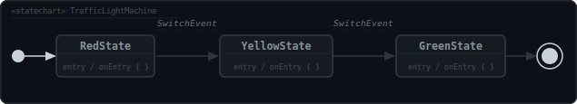

<div align="center">


**A powerful Kotlin Multiplatform state machine library with clean DSL syntax**  
**and first-class Kotlin Coroutines support**

---

[](https://github.com/KStateMachine/kstatemachine/actions)
[](https://codecov.io/gh/nsk90/kstatemachine)
[](https://central.sonatype.com/artifact/io.github.nsk90/kstatemachine)
[](https://jitpack.io/#nsk90/kstatemachine)
[](https://kstatemachine.github.io/kstatemachine/#multiplatform)

[](https://opencollective.com/kstatemachine)
[](https://github.com/KotlinBy/awesome-kotlin)
[](https://android-arsenal.com/details/1/8276)
[](https://kotlinlang.slack.com/archives/C07DVAEKLM8)
[](https://twitter.com/intent/tweet?text=I%20like%20KStateMachine%20library%20%0A%0Ahttps%3A%2F%2Fgithub.com%2Fkstatemachine%2Fkstatemachine&hashtags=kstatemachine,kotlin,opensource)
[](https://www.reddit.com/submit?url=https%3A%2F%2Fgithub.com%2Fkstatemachine%2Fkstatemachine&title=I%20like%20KStateMachine%20library)

---

[📖 Documentation](https://kstatemachine.github.io/kstatemachine) &nbsp;|&nbsp;
[📚 KDoc](https://kstatemachine.github.io/kstatemachine/kdoc/index.html) &nbsp;|&nbsp;
[🚀 Quick Start](#-quick-start) &nbsp;|&nbsp;
[🧪 Samples](#-samples) &nbsp;|&nbsp;
[💾 Install](#-install) &nbsp;|&nbsp;
[💬 Discussions](https://github.com/kstatemachine/kstatemachine/discussions) &nbsp;|&nbsp;
[❤️ Sponsors](#-sponsors)

</div>

---

## What is KStateMachine?

**KStateMachine** lets you model complex application logic as
a [finite state machine](https://en.wikipedia.org/wiki/Finite-state_machine)
or [statechart](https://www.sciencedirect.com/science/article/pii/0167642387900359/pdf) using an expressive Kotlin DSL.
It runs on every Kotlin Multiplatform target, integrates seamlessly with Kotlin Coroutines, and has **zero mandatory
dependencies**.

---

## 🚀 Quick Start

### Animated traffic light

<div align="center">

</div>

```kotlin
// Events
object SwitchEvent : Event

// States
sealed class States : DefaultState() {
    object RedState : States()
    object YellowState : States()
    object GreenState : States(), FinalState  // machine stops here
}

fun main() = runBlocking {
    val machine = createStateMachine(scope = this) {
        addInitialState(RedState) {
            onEntry { println("🔴 Red — stop!") }
            onExit { println("   leaving red") }

            transition<SwitchEvent> {
                targetState = YellowState
                onTriggered { println("   → switching…") }
            }
        }

        addState(YellowState) {
            onEntry { println("🟡 Yellow — get ready") }
            transition<SwitchEvent>(targetState = GreenState)
        }

        addFinalState(GreenState) {
            onEntry { println("🟢 Green — go!") }
        }

        onFinished { println("✅ Done") }
    }

    machine.processEvent(SwitchEvent) // Red → Yellow
    machine.processEvent(SwitchEvent) // Yellow → Green (finished)
}
```

### Output

```
🔴 Red — stop!
   → switching…
   leaving red
🟡 Yellow — get ready
🟢 Green — go!
✅ Done
```

---

## ✨ Key Features

**Integration**

| Feature                                                                                        | Description                                                  |
|------------------------------------------------------------------------------------------------|--------------------------------------------------------------|
| [Kotlin DSL](https://kotlinlang.org/docs/type-safe-builders.html)                              | Declarative, readable structure; plain API also available    |
| [Kotlin Coroutines](https://kstatemachine.github.io/kstatemachine/pages/multithreading.html)   | Suspending functions in listeners and guards; fully optional |
| [Kotlin Multiplatform](https://kstatemachine.github.io/kstatemachine/pages/multiplatform.html) | JVM, Android, iOS, JS, Wasm, Native                          |
| Zero dependencies                                                                              | Core artifact depends only on the Kotlin stdlib              |

**State management**

| Feature                                                                                                                                   | Description                                                                                                                                                        |
|-------------------------------------------------------------------------------------------------------------------------------------------|--------------------------------------------------------------------------------------------------------------------------------------------------------------------|
| [Event-based](https://kstatemachine.github.io/kstatemachine/pages/events.html)                                                            | Transitions fire in response to events                                                                                                                             |
| [Reactive listeners](https://kstatemachine.github.io/kstatemachine/pages/states/states.html#listen-states)                                | Observe machines, states, state groups, and transitions                                                                                                            |
| [Guarded & conditional transitions](https://kstatemachine.github.io/kstatemachine/pages/transitions/transitions.html#guarded-transitions) | Dynamic target state computed at runtime                                                                                                                           |
| [Nested states](https://kstatemachine.github.io/kstatemachine/pages/states/states.html#nested-states)                                     | Full statechart hierarchy with [cross-level transitions](https://kstatemachine.github.io/kstatemachine/pages/transitions/transitions.html#cross-level-transitions) |
| [Composed state machines](https://kstatemachine.github.io/kstatemachine/pages/states/states.html#composed-nested-state-machines)          | Embed one machine as a child state of another                                                                                                                      |
| [Pseudo states](https://kstatemachine.github.io/kstatemachine/pages/states/pseudo_states.html)                                            | History, redirect, and other behavioural helpers                                                                                                                   |
| [Typesafe transitions](https://kstatemachine.github.io/kstatemachine/pages/transitions/typesafe_transitions.html)                         | Carry typed data from event to target state                                                                                                                        |
| [Parallel states](https://kstatemachine.github.io/kstatemachine/pages/states.html#parallel-states)                                        | Run orthogonal regions simultaneously                                                                                                                              |
| [Undo transitions](https://kstatemachine.github.io/kstatemachine/pages/transitions/transitions.html#undo-transitions)                     | Navigate back like a stack-based FSM                                                                                                                               |

**Tooling**

| Feature                                                                                   | Description                                                                                                            |
|-------------------------------------------------------------------------------------------|------------------------------------------------------------------------------------------------------------------------|
| [Export](https://kstatemachine.github.io/kstatemachine/pages/export.html)                 | Generate [PlantUML](https://plantuml.com/) or [Mermaid](https://mermaid.js.org/) diagrams from your machine definition |
| [Persist & restore](https://kstatemachine.github.io/kstatemachine/pages/persistence.html) | Record processed events and replay them to restore state; `kotlinx.serialization` built in                             |
| [Testing helpers](https://kstatemachine.github.io/kstatemachine/pages/testing.html)       | `startFrom(state)` bypasses normal init, enabling focused unit tests                                                   |

---

## 📄 Documentation

> [!IMPORTANT]
> Full documentation lives at
**[kstatemachine.github.io/kstatemachine](https://kstatemachine.github.io/kstatemachine)**  
> KDoc for every class:
**[kstatemachine.github.io/kstatemachine/kdoc](https://kstatemachine.github.io/kstatemachine/kdoc/index.html)**

---

## ❤️ Sponsors

If KStateMachine saves you time, please consider supporting the project:

- ⭐ **Star this repo** — it helps others discover it
- ❤️ **[GitHub Sponsors](https://github.com/sponsors/nsk90)** — one-time or recurring donations
- 💛 **[Open Collective](https://opencollective.com/kstatemachine)** — transparent team funding

---

## 🧪 Samples

Full app samples and 20+ focused code samples are listed on the
**[Samples page](https://kstatemachine.github.io/kstatemachine/pages/samples.html)** in the documentation.

<p align="center">
  
</p>

---

## ✍️ Publications

* [Integrating State Machines with MVI Architecture in Kotlin for Reactive Android Apps](https://medium.com/p/7327c3ff34f3)

---

## 💾 Install

KStateMachine is published to **Maven Central** and **JitPack**.

```kotlin
dependencies {
    // Core (zero dependencies)
    implementation("io.github.nsk90:kstatemachine:<Tag>")

    // + Kotlin Coroutines integration (optional)
    implementation("io.github.nsk90:kstatemachine-coroutines:<Tag>")

    // + kotlinx.serialization for state persistence (optional)
    implementation("io.github.nsk90:kstatemachine-serialization:<Tag>")
}
```

Replace `<Tag>` with the current version shown in the Maven Central badge above.  
See the [full install guide](https://kstatemachine.github.io/kstatemachine/pages/install.html) for Gradle Kotlin DSL,
Groovy DSL, and JitPack variants.

---

## 🏗️ Build

```bash
./gradlew build          # build all modules
./gradlew :tests:jvmTest # run all tests (JVM target)
```

Or open in IntelliJ IDEA and run from there.

---

## 🤝 Contribution

The library is in **stable** phase — but feature proposals and pull requests are welcome!  
Please read [CONTRIBUTING.md](./CONTRIBUTING.md) before submitting.

---

## 🙋 Support

| Channel                                                                          | Best for                       |
|----------------------------------------------------------------------------------|--------------------------------|
| [Slack `#kstatemachine`](https://kotlinlang.slack.com/archives/C07DVAEKLM8)      | Questions & discussions        |
| [GitHub Discussions](https://github.com/kstatemachine/kstatemachine/discussions) | Questions & longer discussions |
| [GitHub Issues](https://github.com/KStateMachine/kstatemachine/issues)           | Bug reports & feature requests |

When asking on other platforms, include a link to this repo or use the `#kstatemachine` tag.

---

## 🗺️ Roadmap

- [ ] IntelliJ IDEA plugin — state machine visualization and editing

---

## 🏅 Thanks to supporters

[](https://github.com/kstatemachine/kstatemachine/stargazers)
[](https://github.com/kstatemachine/kstatemachine/network/members)

---

## 🖋️ License

Licensed under the permissive [Boost Software License](./LICENSE).
