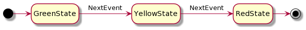

# KStateMachine


[](https://sonarcloud.io/dashboard?id=nsk90_kstatemachine)
[](https://jitpack.io/#nsk90/kstatemachine)

KStateMachine is a Kotlin DSL library for creating finite state
machines [FSM](https://en.wikipedia.org/wiki/Finite-state_machine) and hierarchical state machines
(HSM) and listen to its states and transitions changes to perform side effects.

## Install

Add the [JitPack](https://jitpack.io/#nsk90/kstatemachine/Tag) repository to your build file. Add it
in your root `build.gradle` at the end of repositories:

```groovy
allprojects {
    repositories {
        //  ...
        maven { url 'https://jitpack.io' }
    }
}
```

Add the dependency:

```groovy
dependencies {
    implementation 'com.github.nsk90:kstatemachine:<Tag>'
}
```

Where `<Tag>` is a library version.

## Overview

Main features are:

* Kotlin DSL syntax for defining state machine structure;
* [Guarded](#guarded-transitions) and [Conditional transitions](#conditional-transitions) with
  dynamic target state which is calculated in a moment of event processing depending on application
  business logic;
* [Nested states](#nested-states) - hierarchical state machines (HSMs);
* [Argument](#arguments) passing for events and transitions;
* [Export state machine](#export) structure to [PlantUML](https://plantuml.com/)
  and  [Graphviz](https://graphviz.org/).

_The library is currently in a development phase. You are welcome to propose useful features._

Building blocks (main classes) of this library:

* `StateMachine` - is a collection of states and transitions between them, processes events when
  started;
* `State` - states where state machine can go to;
* `Event` - is a base class for events or other words actions which are processed by state machine
  and may trigger transitions;
* `Transition` - is an operation of moving from one state to another.

Working with state machine consists of two steps:

* Creation and initial setup, here you may set custom actions (side effects) via listeners to be
  performed on entering/exiting states and transitions between them;
* Processing events, on which state machine can switch its states and notify about changes.

```kotlin
val machine = createStateMachine {
    // Setup is made in this block ...
}
// After setup it is ready to process events
machine.processEvent(SwitchGreenEvent)
// ...
machine.processEvent(SwitchYellowEvent)
```

## Finishing traffic light sample



```kotlin
// Define events
sealed class Events {
    object YellowEvent : Event
    object RedEvent : Event
}

// Define states
sealed class States {
    object GreenState : DefaultState("Green")
    object YellowState : DefaultState("Yellow")
    object RedState : DefaultFinalState("Red") // State machine finishes when enters final state
}

fun main() {
    // Create state machine and configure its states in a setup block
    val machine = createStateMachine {
        addInitialState(States.GreenState) {
            // Add state listeners
            onEntry { println("Enter $name state") }
            onExit { println("Exit $name state") }

            // Setup transition on YellowEvent
            transition<Events.YellowEvent> {
                targetState = States.YellowState
                // Add transition listener
                onTriggered { println("Transition on ${it.event}") }
            }
        }

        addState(States.YellowState) {
            transition<Events.RedEvent> { targetState = States.RedState }
        }

        addFinalState(States.RedState)
    }

    // Process events
    machine.processEvent(Events.YellowEvent)
    machine.processEvent(Events.RedEvent)
}
```

## Create state machine

First we create a state machine with `createStateMachine()` function:

```kotlin
val machine = createStateMachine(
    "Traffic lights" // Optional name is convenient for logging debugging and export
) {
    // Set up state machine ...
}
```

## Setup states

In state machine setup block we define states with `state()` function and set initial one
with `setInitialState()`:

```kotlin
createStateMachine {
    // Use state() function to create State and add it to StateMachine
    val greenState = state()
    // State name is optional and is useful to getting state instance
    // after state machine setup and for debugging
    val yellowState = state("Yellow")

    // State machine enters this state after setup is complete
    setInitialState(greenState)
}
```

You can use `initialState()` and `addInitialState()` shortcut functions to create/add and set
initial state:

```kotlin
createStateMachine {
    val greenState = initialState("Green")
    // ...
}
```

You can use `State` subclasses with `addState()` and `addInitialState()` functions:

```kotlin
object SomeState : DefaultState()

createStateMachine {
    val someState = addState(SomeState())
    // ...
}
```

In state setup blocks we can add listeners for states:

```kotlin
state {
    onEntry { println("Enter $name state") }
    onExit { println("Exit $name state") }
}
```

Or even shorter:

```kotlin
state().onEntry { /*...*/ }
```

## Setup transitions

In a state setup block we define which events will trigger transitions to
another states. Transition is created  with `transition()` function:

```kotlin
greenState {
    // Setup transition which is triggered on YellowEvent
    transition<YellowEvent> {
        // Set target state where state machine go when this transition is triggered
        targetState = yellowState
    }
}
```

_Note: only one transition is possible per event type. This means you cannot have multiple
transitions parametrized with same `Event` subclass._

Transition may have no target state (`targetState` is null) which means that state machine stays in
current state when such transition triggers:

```kotlin
greenState {
    transition<YellowEvent>()
}
```

Same as for states we can listen to transition triggering:

```kotlin
transition<YellowEvent> {
    targetState = yellowState
    onTriggered { println("Transition to $targetState is triggered by ${it.event}") }
}
```

There is extended version of `transition()` function, it is called `transitionTo()`.
It works the same way but takes lambda to calculate target state.
This allows to use `lateinit` state variables and choose target state depending on application business logic 
like with [conditional transitions](#conditional-transitions) but gives less flexibility:

```kotlin
createStateMachine {
    lateinit var yellowState: State

    greenState {
        transitionTo<YellowEvent> {
            targetState = { yellowState }
        }
    }

    yellowState = state {
        // ...
    }
}
```

### Listen to all transitions in one place

There might be many transitions from one state to another. It is possible to listen to all of them
in state machine setup block:

```kotlin
createStateMachine {
    // ...
    onTransition { sourceState, targetState, event, argument ->
        // Listen to all triggered transitions here
    }
}
```

### Guarded transitions

Guarded transition is triggered only if specified guard function returns true. Guarded transition is
a special kind of [conditional transition](#conditional-transitions) with shorter syntax.
Use `transition()` or `transitionTo()` functions to create guarded transition:

```kotlin
initialState {
    transition<SwitchEvent> {
        guard = { someValue == "myValue" }
        targetState = second
        // ...
    }
}
```

### Conditional transitions

State machine becomes more powerful tool when you can choose target state depending on your business
logic (some external data).
Conditional transitions give you maximum flexibility on choosing target state
and conditions when transition is triggered.

There are three options to choose transition direction:

* `stay()` - transition is triggered but state is not changed;
* `targetState(nextState)` - transition is triggered and state machine goes to the specified state;
* `noTransition()` - transition is not triggered.

Use `transitionConditionally()` function to create conditional transition and specify a function
which makes desired decision:

```kotlin
redState {
    // A conditional transition helps to control when it 
    // should be triggered and determine its target state
    transitionConditionally<SwitchGreenEvent> {
        direction = {
            // Suppose you have a function returning some 
            // business logic value which may differ
            fun getCondition() = 0

            when (getCondition()) {
                0 -> targetState(greenState)
                1 -> targetState(yellowState)
                2 -> stay()
                else -> noTransition()
            }
        }
    }
    // Same as before you can listen when conditional transition is triggered
    onTriggered { println("Conditional transition is triggered") }
}
```

## Logging

You can enable internal state machine logging on your platform:

```kotlin
createStateMachine {
    // ...
    logger = StateMachine.Logger { println(it) }
}
```

## Error handling

By default, state machine simply ignores events that does not match any defined transition. You can
see those events if logging is enabled or use custom `IgnoredEventHandler`:

```kotlin
createStateMachine {
    // ...
    ignoredEventHandler = StateMachine.IgnoredEventHandler { event, _ ->
        error("unexpected $event")
    }
}
```

It is not allowed to call `processEvent()` while state machine is already processing event. For
example from notification listener. By default, state machine will throw exception in this case, but
you can set custom `PendingEventHandler`:

```kotlin
createStateMachine {
    // ...
    pendingEventHandler = StateMachine.PendingEventHandler { pendingEvent, _ ->
        error(
            "$this can not process pending $pendingEvent " +
                    "as event processing is already running. " +
                    "Do not call processEvent() from notification listeners."
        )
    }
}
```

## Finishing state machine

Some of state machines are infinite, but other ones may finish. State machine that was finished
stops processing incoming events. To make state machine finishing, add `FinalState` to it
with `finalState()` function or add any subclass of `FinalState` with `addState()` function. State
machine finishes when enters top-level `FinalState` and notifies its listeners with `onFinished()`
callback.

```kotlin
createStateMachine {
    final = finalState("final")
    setInitialState(final)

    onFinished { println("State machine is finished") }
}
```

_Note: `FinalState` can not have its own transitions._

## Nested states

With nested states you can build hierarchical state machines and inherit transitions by grouping
states.

To create nested states simply use same functions (`state()`, `initialState()` etc.) as for state
machine but in state setup block:

```kotlin
val machine = createStateMachine {
    val topLevelState = initialState {
        // ...
        val nestedState = initialState {
            // ...
            initialState()
            state()
            finalState()
        }
    }
}
```

_Note: cross-level transitions are not supported yet._

### Inherit transitions by grouping states

Suppose you have three states that all should have a transitions to another state. You can
explicitly set this transition for each state but with this approach complexity grows and when you
add fourth state you have to remember to add this specific transition. This problem can be solved with
adding parent state which defines such transition and groups its child states. Child states
inherit there parent transitions.


## Arguments

_Note: Type of arguments is `Any?`, so it is not type safe ot use them._

### Event argument

Usually if event may hold some data we define Event subclass, it is type safe. Sometimes if data is
optional it may be simpler to use event argument. You can specify arbitrary argument with an event
in `processEvent()` function. Then you can get this argument in state and transition listeners.

```kotlin
val machine = createStateMachine {
    state("offState").onEntry {
        println("Event ${it.event} argument: ${it.argument}")
    }
    // ...
}
// Pass argument with event
machine.processEvent(TurnOn, 42)
```

### Transition argument

If transition listener produce some data, you can pass it to target state as a transition argument:

```kotlin
val second = state("second").onEntry {
    println("Transition argument: ${it.transition.argument}")
}
state("first") {
    transition<SwitchEvent> {
        targetState = second
        onTriggered { it.transition.argument = 42 }
    }
}
```

_Note: it is up to user to control that argument field is set from one listener. You can use some
mutable data structure and fill it from multiple listeners._

## Multithreading

State machine is designed to work in single thread. So if you need to process events from different
threads you can post them to some thread safe queue and start single thread which will pull events
from that queue in a loop and call `processEvent()` function.

## Export

_Note: conditional transitions depending on external data might not work._

### PlantUML

Use `exportToPlantUml()` extension function to export state machine
to [PlantUML state diagram](https://plantuml.com/ru/state-diagram).

```kotlin
val machine = createStateMachine { /*...*/ }
println(machine.exportToPlantUml())
```

Copy/paste resulting output to [Plant UML online editor](http://www.plantuml.com/plantuml/)

### Graphviz

Graphviz uses [DOT language](https://graphviz.org/doc/info/lang.html) to visualize graphs.
Use `exportToDot()` extension function to export state machine to DOT language.

```kotlin
val machine = createStateMachine { /*...*/ }
println(machine.exportToDot())
```

Copy/paste resulting output to any tool supporting DOT language, for example:

* https://dreampuf.github.io/GraphvizOnline/
* http://magjac.com/graphviz-visual-editor/

_Note: Graphviz export does not support nested states._

## Consider using Kotlin `sealed` classes

With sealed classes for states and events your state machine structure may look simpler.
Try to compare this two samples they both are doing the same thing but 
using of sealed classes makes code self explaining:

[Minimal sealed classes sample](./samples/src/main/kotlin/ru/nsk/samples/MinimalSealedClassesSample.kt) vs 
[Minimal syntax sample](./samples/src/main/kotlin/ru/nsk/samples/MinimalSyntaxSample.kt)

Also sealed classes eliminate need of using `lateinit` states variables 
and reordering of states in state machine setup block to have a valid state references for transitions. 

## Do not

State machine is a powerful tool to control states so let it do its job, do not select target state
by sending different event types depending on business logic state, let the state machine to make
decision for you.

Wrong:

```kotin
if (somethingHappend)
    machine.processEvent(FirstEvent)
else 
    machine.processEvent(SecondEvent)
```

Correct - let the state machine to make decisions on an event:

```kotin
machine.processEvent(SomethingHappenedEvent)
```

## Samples

* [Full syntax sample](./samples/src/main/kotlin/ru/nsk/samples/FullSyntaxSample.kt)
  shows different syntax variants and library possibilities in one place, so it looks messy
* [PlantUML nested states export sample](./samples/src/main/kotlin/ru/nsk/samples/PlantUmlExportSample.kt)
* [Inherit transitions by grouping states sample](./samples/src/main/kotlin/ru/nsk/samples/InheritTransitionsSample.kt)
* [Graphviz DOT export sample](./samples/src/main/kotlin/ru/nsk/samples/GraphvizDotExportSample.kt)
* [Minimal sealed classes sample](./samples/src/main/kotlin/ru/nsk/samples/MinimalSealedClassesSample.kt)
* [Minimal syntax sample](./samples/src/main/kotlin/ru/nsk/samples/MinimalSyntaxSample.kt)

## License

[MIT License](./LICENSE)