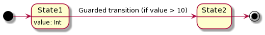
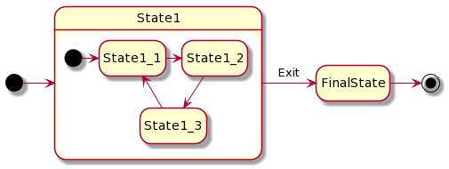
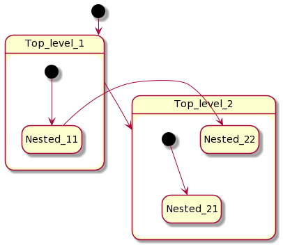
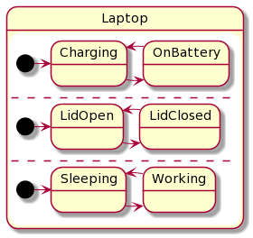

# KStateMachine documentation

## Workflow

Building blocks (main interfaces) of the library:

* `StateMachine` - is a collection of states and transitions between them, processes events when started
* `IState` - states where state machine can go to
* `Event` - is a base interface for events which are processed by state machine and may trigger
  transitions
* `Transition` - is an operation of moving from one state to another
* `TransitionParams` - information about current transition, passed to notification functions

Working with state machine consists of two major steps:

1. Creation with initial setup and starting
2. Processing events, on which state machine can switch its states and notify about changes

```kotlin
val machine = createStateMachine {
    // Setup is made in this block ...
}
// After setup and start, it is ready to process events
machine.processEvent(GreenEvent)
// ...
machine.processEvent(YellowEvent)
```

## Create state machine

First we create a state machine with `createStateMachine()` function:

```kotlin
val machine = createStateMachine(
    "Traffic lights" // Optional name is convenient for logging debugging and export
) {
    // Set up state machine ...
}
```

By default, `createStateMachine()` starts state machine. You can control it using `start` argument.

## Setup states

### Default states

`IState` is just an interface, `DefaultState` & co. are implementations.

Use default states if you do not need to distinguish states (by type) outside from state machine. Otherwise, consider
using [state subclasses](#state-subclasses).

In state machine setup block define states with `initialState()`, `state()` and `finalState()` functions:

```kotlin
createStateMachine {
    // Use initialState() function to create initial State and add it to StateMachine
    // State machine enters this state after setup is complete
    val greenState = initialState()
    // State name is optional and is useful to getting state instance
    // after state machine setup and for debugging
    val yellowState = state("Yellow")
    val redState = finalState()
    // ...
}
```

You can use `setInitialState()` function to set initial state separately:

```kotlin
createStateMachine {
    val greenState = state()
    setInitialState(greenState)
    // ...
}
```

### State subclasses

You can use your own `IState` subclasses with `addInitialState()`, `addState()` and `addFinalState()` functions.
Subclass `DefaultState`, `DefaultFinalState` or their [data](#typesafe-transitions) analogs `DefaultDataState`
, `DefaultFinalDataState`, then you can easily distinguish your states by type when observing state changes:

```kotlin
class SomeState : DefaultState()

createStateMachine {
    val someState = addState(SomeState())
    // ...
}
```

### Listen states

In state setup blocks we can add listeners for states:

```kotlin
state {
    onEntry { println("Enter $name state") }
    onExit { println("Exit $name state") }
}
```

Or even shorter:

```kotlin
state().onEntry { /* ... */ }
```

`onEntry` and `onExit` DSL methods provide `once` argument. If it is set to `true` the listener will be removed after
the first triggering.

```kotlin
state().onEntry(once = true) { /* ... */ }
```

_Note: it is safe to add and remove listeners from any machine callbacks, library protects its internal loops from such
modifications._

### Listen group of states

If you need to perform some actions depending on active statuses of two or more states use `onActiveAllOf()`
and `onActiveAnyOf()` functions.

```kotlin
onActiveAllOf(State1, State2, State3) {
    println("states active: $it")
}
```

## Setup transitions

In a state setup block we define which events will trigger transitions to another states. The simplest transition is
created with `transition()` function:

```kotlin
greenState {
    // Setup transition which is triggered on YellowEvent
    transition<YellowEvent> {
        // Set target state where state machine go when this transition is triggered
        targetState = yellowState
    }
    // The same with shortcut version
    transition<RedEvent>("My transition", redState)
}
```

Same as for states we can listen to transition triggering:

```kotlin
transition<YellowEvent> {
    targetState = yellowState
    onTriggered { println("Transition to $targetState is triggered by ${it.event}") }
}
```

There is an extended version of `transition()` function, it is called `transitionOn()`. It works the same way but takes
a lambda to calculate target state. This allows to use `lateinit` state variables and to choose target state depending
on an application business logic like with [conditional transitions](#conditional-transitions) but with shorter syntax
and less flexibility:

```kotlin
createStateMachine {
    lateinit var yellowState: State

    greenState {
        transitionOn<YellowEvent> {
            targetState = { yellowState }
        }
    }

    yellowState = state {
        // ...
    }
}
```

### Target-less transitions

Transition may have no target state (`targetState` is null) which means that state machine stays in current state when
such transition triggers, it is useful to perform some actions without changing current state:

```kotlin
greenState {
    transition<YellowEvent> {
        onTriggered { /* ... */ }
    }
}
```

_Note: Such transitions are also called internal._

### Listen to all transitions in one place

There might be many transitions from one state to another. It is possible to listen to all of them in state machine
setup block:

```kotlin
createStateMachine {
    // ...
    onTransition {
        // Listen to all triggered transitions here
        println(it.event)
    }
}
```

### Guarded transitions

Guarded transition is triggered only if specified guard function returns `true`. Guarded transition is a special kind
of [conditional transition](#conditional-transitions) with shorter syntax. Use `transition()` or `transitionOn()`
functions to create guarded transition:

```kotlin
state1 {
    transition<SwitchEvent> {
        guard = { value > 10 }
        targetState = state2
        // ...
    }
}
```

See [guarded transition sample](https://github.com/nsk90/kstatemachine/tree/master/samples/src/main/kotlin/ru/nsk/samples/GuardedTransitionSample.kt)



### Conditional transitions

State machine becomes more powerful tool when you can choose target state depending on your business logic (some
external data). Conditional transitions give you maximum flexibility on choosing target state and conditions when
transition is triggered.

There are three options to choose transition direction:

* `stay()` - transition is triggered but state is not changed;
* `targetState(nextState)` - transition is triggered and state machine goes to the specified state;
* `noTransition()` - transition is not triggered.

Use `transitionConditionally()` function to create conditional transition and specify a function which makes desired
decision:

```kotlin
redState {
    // A conditional transition helps to control when it 
    // should be triggered and determine its target state
    transitionConditionally<GreenEvent> {
        direction = {
            // Suppose you have a function returning some 
            // business logic value which may differ
            fun getCondition() = 0

            when (getCondition()) {
                0 -> targetState(greenState)
                1 -> targetState(yellowState)
                2 -> stay()
                else -> noTransition()
            }
        }
    }
    // Same as before you can listen when conditional transition is triggered
    onTriggered { println("Conditional transition is triggered") }
}
```

### Transition event type matching

By default, event type that triggers transition is matched as instance of specified event class. For
example `transition<SwitchEvent>()` matches `SwitchEvent` class and its subclasses. If you have event hierarchy it might
be necessary to control matching mechanism, it might be done with `eventMatcher` argument of transition builder
functions:

```kotlin
transition<SwitchEvent> {
    eventMatcher = isEqual()
}
```

There are two predefined event matchers:

* `isInstanceOf()` matches specified class and its subclasses (default)
* `isEqual()` matches only specified class

You can define your own matchers by subclassing `EventMatcher` class.

## Undo transitions

Transitions may be undone with `StateMachine.undo()` function or alternatively by sending special `UndoEvent` to machine
like this `machine.processEvent(UndoEvent)`. State Machine will roll back last transition which is usually is switching
to previous state (except target-less transitions).
This API might be called as many times as needed.
To implement this feature library stores transitions in a stack, it takes memory,
so this feature is disabled by default and must be enabled explicitly using `createStateMachine(enableUndo = true)`
argument.

Undo functionality is implemented as `Event`, so it possible to call `undo()` from notification callbacks, if you use
`QueuePendingEventHandler` (which is default) or its analog.

For example if states of state machine represent UI screens, `undo()` acts like some kind of `navigateUp()` function.

Internally every `UndoEvent` is transformed to `WrappedEvent` which stores original event and argument.
When some state is entered as a result of undo operation you can access original event and argument with
`unwrappedEvent` and `unwrappedArgument` extension properties of `TransitionParams` class.
Original event is the event that triggered original transition to this state.

```kotlin
state {
    onEntry { transitionParams -> // when called as result of undo() operation
        transitionParams.event // is WrappedEvent
        transitionParams.unwrappedEvent // is original event
        (transitionParams.event as WrappedEvent).event // same as using unwrappedEvent extension
    }
}
```

See [undo transition sample](https://github.com/nsk90/kstatemachine/tree/master/samples/src/main/kotlin/ru/nsk/samples/UndoTransitionSample.kt)

## Logging

You can enable internal state machine logging on your platform.

On JVM:

```kotlin
createStateMachine {
    logger = StateMachine.Logger { println(it) }
    // ...
}
```

On Android:

```kotlin
createStateMachine {
    logger = StateMachine.Logger { Log.d(this::class.qualifiedName, it) }
    // ...
}
```

## Finishing states and state machine

Some of state machines and states are infinite, but other ones may finish.

* In `ChildMode.EXCLUSIVE` state or state machine finishes when enters top-level final state.
* In `ChildMode.PARALLEL` state or state machine finishes when all its children has finished.

To make a state final, it must implement `FinalState` marker interface.
Built-in implementation of such state is `DefaultFinalState`.
It can be created directly with `finalState()` function or be subclassed and added with `addFinalState()` function.
Alternatively you can inherit basic `DefaultState` and mark it with `FinalState` explicitly like here:

```kotlin
sealed class States : DefaultState() {
    object State1 : States()
    object State2 : States(), FinalState
}
```

Finishing of states and state machines is treated little differently.
State machine that was finished stops processing incoming events.
But when some nested state is finished its transitions are still active,
only notification is triggered and `isFinished` property set.

Notifications about finishing are available in two forms:

1) Triggering of `onFinished()` listener callback. This is the only option for `StateMachine`.
    ```kotlin
    val machine = createStateMachine {
        val final = finalState("final")
        setInitialState(final)
    
        onFinished { println("State machine is finished") }
    }
    machine.isFinished // is true
    ```
2) Generation and processing of special `FinishedEvent`. This option is also available for composite states and useful
   for performing transitions on finishing:

    ```kotlin
    createStateMachine {
        val state2 = state("state2")
   
        initialState("state1") {
            val final = finalState("final")
            setInitialState(final)
            
            // this transition matches only FinishedEvent generated by finishing of "state1"
            transition<FinishedEvent>(targetState = state2)
        }
    }
    ```
   Transition for `FinishedEvent` is detected by the library and matched by special kind of `EventMatcher`,
   so such transition is triggered only for `FinishedEvent` that corresponds to this state.
   `FinishingEvent` generated by finishing of another state will not trigger such transition.
   See [transition on FinishedEvent sample](https://github.com/nsk90/kstatemachine/tree/master/samples/src/main/kotlin/ru/nsk/samples/FinishedEventSample.kt).

## Nested states

With nested states you can build hierarchical state machines and inherit transitions by grouping states.

To create nested states simply use same functions (`state()`, `initialState()` etc.) as for state machine but in state
setup block:

```kotlin
val machine = createStateMachine {
    val topLevelState = initialState {
        // ...
        val nestedState = initialState {
            // ...
            initialState()
            state()
            finalState()
        }
    }
}
```

### Inherit transitions by grouping states

Suppose you have three states that all should have a transitions to another state. You can explicitly set this
transition for each state but with this approach complexity grows and when you add fourth state you have to remember to
add this specific transition. This problem can be solved with adding parent state which defines such transition and
groups its child states. Child states inherit there parent transitions.



A child state can override an inherited transition. To override parent transition child state should define any
transition that matches the event.

```kotlin
createStateMachine {
    val state2 = state("state2")
    // all nested states inherit this parent transition
    transition<SwitchEvent> { targetState = state2 }

    // child state overrides transitions for all events
    initialState("state1") { transition<Event>() }
}
```

### Cross-level transitions

A transition can have any state as its target. This means that the target state does not have to be on the same level in
the state hierarchy as the source state.



## Composed (nested) state machines

`StateMachine` is a subclass of `IState`, this allows to use it as a child of another state machine like a simple state.
The parent state machine treats the child machine as an atomic state. It is not possible to reference states of a child
machine from parent transitions and vise versa. Child machine is automatically started when parent enters it. Events
from parent machine are not passed to it child machines. Child machine receives events only from its
own `processEvent()`
calls.

## Parallel states

Sometimes it might be useful to have a state machine containing mutually exclusive properties. Assume your laptop, it
might be charging, sleeping, its lid may be open at the same time. If you try to create a state machine for those
properties you will have _3 * 3 = 9_ amount of states
(_"Charging, Sleeping, LidOpen"_, _"OnBattery, Sleeping, LidOpen"_, etc...). This is where parallel states come into
play. This feature helps to avoid combinatorial explosion of states. Using parallel states this machine will look like
this:



Set `childMode` argument of a state machine, or a state creation functions to `ChildMode.PARALLEL`. When a parent state
with parallel child mode is entered or exited, all its child states will be simultaneously entered or exited:

```kotlin
createStateMachine(childMode = ChildMode.PARALLEL) {
    state("Charger") {
        initialState("Charging") { /* ... */ }
        state("OnBattery") { /* ... */ }
    }
    state("Lid") { /* ... */ }
    // ..
}
```

There is no way to process multiple transitions for one event by using parallel states, only one transition may be
triggered for each event.

## Pseudo states

Pseudo states are special kind of states that machine cannot enter, but they are useful to describe additional
logic in machine behaviour.

### Choice state

Choice state allows to select target state depending on some condition. When transition targeting a choice state is
triggered, choice function is evaluated and machine goes to resulting state:

```kotlin
choiceState {
    if (event.value > 3) State1 else State2
}
```

### History state

There are two types of history states, shallow and deep. Shallow history state is used to represent the most recently
active child (its neighbour) of a parent state. It does not recurse into this child's active configuration (sub states),
initial states will be used. Deep history state in contrast reflects the most recent active configuration of the parent
state (including all sub states).
You can specify default state which will be used if history was not recorded yet (parent was not active).
When default state is not specified, parent initial state will be entered on transition to history state.

```kotlin
val machine = createStateMachine {
    state {
        val state11 = initialState()
        val state12 = state()
        historyState(defultState = state12)
    }
    state {
        // ...
    }
}
```

## Typesafe transitions

It is a common case when a state expects to receive some data from an event. Library provides typesafe API for such
case. It is implemented with `DataEvent` and `DataState`. Both interfaces are parameterized with data type. To create
typesafe transition use `dataTransition()` and `dataTransitionOn()` functions. This API helps to ensure that event data
parameter type matches data parameter type that is expected by a target state of a transition. Compiler will protect you
from defining a transition with incompatible data type parameters of event and target state.

```kotlin
class StringEvent(override val data: String) : DataEvent<String>

createStateMachine {
    val state2 = dataState<String> {
        onEntry { println("State data: $data") }
    }

    initialState {
        dataTransition<StringEvent, String> { targetState = state2 }
    }
}
```

State `data` field value is set and might be accessed only while the state is active. When `DataState` is activated it
requires data value from a `DataEvent`. This should be taken into account when mixing typesafe transitions with
cross-level transitions. Cross-level transition may trigger `DataState` activation implicitly, and exception will be
thrown in such case.

## Arguments

_Note: Type of arguments is `Any?`, so it is not type safe ot use them._

### Event argument

Usually if event may hold some data we define `Event` subclass, it is type safe. Sometimes if data is optional it may be
simpler to use event argument. You can specify arbitrary argument with an event in `processEvent()` function. Then you
can get this argument in a state and transition listeners.

```kotlin
val machine = createStateMachine {
    state("offState").onEntry {
        println("Event ${it.event} argument: ${it.argument}")
    }
    // ...
}
// Pass argument with event
machine.processEvent(TurnOn, 42)
```

### Transition argument

If transition listener produce some data, you can pass it to target state as a transition argument:

```kotlin
val second = state("second").onEntry {
    println("Transition argument: ${it.transition.argument}")
}
state("first") {
    transition<SwitchEvent> {
        targetState = second
        onTriggered { it.transition.argument = 42 }
    }
}
```

_Note: it is up to user to control that argument field is set from one listener. You can use some mutable data structure
and fill it from multiple listeners._

## Error handling

### Ignored events

By default, state machine simply ignores events that does not match any defined transition. You can see those events if
logging is enabled or use custom `IgnoredEventHandler` for example to throw error:

```kotlin
createStateMachine {
    // ...
    ignoredEventHandler = StateMachine.IgnoredEventHandler { event, _ ->
        error("unexpected $event")
    }
}
```

### Pending events

Pending events are such events that are posted for processing while another event is already processing, for example
from listeners callbacks.

Default `PendingEventHandler` that is created with `queuePendingEventHandler()` stores such events in queue and machine
processes them all after a current one. This allows to call `processEvent()` from listeners callbacks.

If you are using another `PendingEventHandler` implementation, like logging or throwing one created by
`throwingPendingEventHandler()` function, then behaviour of calling `processEvent()` while state machine is already
processing event will depend on `PendingEventHandler` implementation. Pending event may be simply dropped or exception
thrown. Alternatively with custom `PendingEventHandler` you can post such events to some queue to process them later
passing to `processEvent()`. Using of throwing `PendingEventHandler` sample:

```kotlin
createStateMachine {
    // ...
    pendingEventHandler = throwingPendingEventHandler()
}
```

_Note: `PendingEventHandler` that does nothing will not let you process pending events (they will be dropped) as it
leads to undefined machine state and mixed notifications._

### Exceptions from listeners

Event though `KStateMachine` assumes that listener callbacks should not throw exceptions, it may happen in practice.
If your app code throws exceptions in a listener callbacks library catches them, completes transition successfully and
passes the first accured exception to `listenerExceptionHandler`. It simply rethrows exception by default, but you may
want to mute them with custom handler for example.

### Other exceptions

Exceptions coming from other client code callbacks, that are considered to be no-throwing (like guard functions of
transitions) are not caught. Machine will be automatically destroyed with `destroy()` function on such exceptions,
as it is in unpredictable state and cannot be used anymore.
Calling `processEvent()` on destroyed machine will throw also.

## Multithreading and concurrency

State machine is designed to work in single thread. Concurrent access to library classes must be controled by
external synchronization.
If you need to process events from different threads you can post them to some thread safe queue and start a single
thread which will pull events from that queue in a loop and call `processEvent()` function.

## Export

_Note: Currently transitions that use lambdas like `transitionConditionally()` and `transitionOn()` are not exported.
User defined lambdas that are passed to calculate next state could not be correctly called during export process as they
may touch application data that is not valid when export is running._

### PlantUML

Use `exportToPlantUml()` extension function to export state machine
to [PlantUML state diagram](https://plantuml.com/en/state-diagram).

```kotlin
val machine = createStateMachine { /* ... */ }
println(machine.exportToPlantUml())
```

Copy/paste resulting output to [Plant UML online editor](http://www.plantuml.com/plantuml/)

See [PlantUML nested states export sample](https://github.com/nsk90/kstatemachine/tree/master/samples/src/main/kotlin/ru/nsk/samples/PlantUmlExportSample.kt)

## Testing

For testing, it might be useful to check how state machine reacts on events from particular state. There
is `Testing.startFrom()` function which allows starting the machine from a specified state:

```kotlin
lateinit var state2: State

val machine = createStateMachine(start = false) {
    initialState("state1")
    state2 = state("state2")
    // ...
}

machine.startFrom(state2)
```

## Consider using Kotlin `sealed` classes

With sealed classes for states and events your state machine structure may look simpler. Try to compare this two samples
they both are doing the same thing but using of sealed classes makes code self explaining:

[Minimal sealed classes sample](https://github.com/nsk90/kstatemachine/tree/master/samples/src/main/kotlin/ru/nsk/samples/MinimalSealedClassesSample.kt)
vs
[Minimal syntax sample](https://github.com/nsk90/kstatemachine/tree/master/samples/src/main/kotlin/ru/nsk/samples/MinimalSyntaxSample.kt)

Also sealed classes eliminate need of using `lateinit` states variables or reordering of states in state machine setup
block to have a valid state references for transitions.

### Object states

Keep in mind that states are mutated by machine instance, defining them with `object` keyword (i.e. singleton) often
makes your states live longer than machine. It is common use case when you have multiple similar machines
that are using same singleton states sequentially. Library detects such cases automatically by default
(see `autoDestroyOnStatesReuse` argument of `createStateMachine` function) and cleans states allowing for future reuse.
You can disable automatic machine destruction on state reuse, and call `StateMachine.destroy()` manually if required,
or just do not use `object` keyword for defining states.
If you have your own `DefaultState` subclasses that are singletons and has data fields, use
`onCleanup()` callback to clean your data before state reuse.

## Do not

State machine is a powerful tool to control states, so let it do its job. Do not try to rule it from outside
(selecting a target state) by sending different event types depending on business logic state. Let the state machine
to make decisions itself.

Wrong - managing target state from outside:

```kotin
if (somethingHappend)
    machine.processEvent(GoToState1Event)
else 
    machine.processEvent(GoToState2Event)
```

Correct - let the state machine to make decisions on an event:

```kotin
machine.processEvent(SomethingHappenedEvent)
```

In certain scenarios (maybe like state pattern) it is fine to use events like some kind of _setState() / goToState()_
function but in general it is wrong, as events are not commands.
