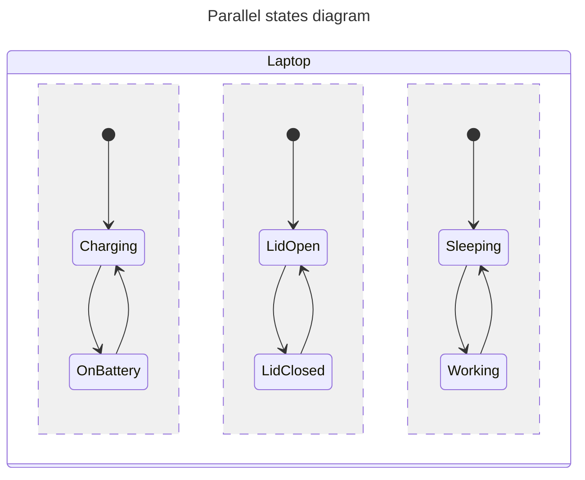

# States
{: .no_toc }

## Page contents
{: .no_toc .text-delta }

- TOC
{:toc}

## Default states

`IState` is just an interface, `DefaultState` & co. are implementations.

Use default states if you do not need to distinguish states (by type) outside from state machine. Otherwise, consider
using [state subclasses](#state-subclasses).

In state machine setup block define states with `initialState()`, `state()`, `finalState()`, etc. factory functions:

```kotlin
createStateMachine(scope) {
    // Use initialState() function to create initial State and add it to StateMachine
    // State machine enters this state after setup is complete
    val greenState = initialState()
    // State name is optional and is useful to getting state instance
    // after state machine setup and for debugging
    val yellowState = state("Yellow")
    val redState = finalState()
    // ...
}
```

You can use `setInitialState()` function to set initial state separately:

```kotlin
createStateMachine(scope) {
    val greenState = state()
    setInitialState(greenState)
    // ...
}
```

## State subclasses

You can use your own `IState` subclasses with `addInitialState()`, `addState()` and `addFinalState()` functions.
Subclass `DefaultState`, `DefaultFinalState` or their [data](https://kstatemachine.github.io/kstatemachine/pages/transitions/typesafe_transitions.html) analogs `DefaultDataState`
, `DefaultFinalDataState`, then you can easily distinguish your states by type when observing state changes:

```kotlin
class SomeState : DefaultState()

createStateMachine(scope) {
    val someState = addState(SomeState())
    // ...
}
```

## Listen states

In state setup blocks we can add listeners for states:

```kotlin
state {
    onEntry { println("Enter $name state") }
    onExit { println("Exit $name state") }
}
```

Or even shorter:

```kotlin
state().onEntry { /* ... */ }
```

`onEntry` and `onExit` DSL methods provide `once` argument. If it is set to `true` the listener will be removed after
the first triggering.

```kotlin
state().onEntry(once = true) { /* ... */ }
```


{: .note }
It is safe to add and remove listeners from any machine callbacks, library protects its internal loops from such
modifications.

## Listen group of states

If you need to perform some actions depending on active statuses of two or more states use `onActiveAllOf()`
and `onActiveAnyOf()` functions.

```kotlin
onActiveAllOf(State1, State2, State3) {
    println("states active: $it")
}
```

## Nested states

With nested states you can build hierarchical state machines and inherit transitions by grouping states.

To create nested states simply use same functions (`state()`, `initialState()` etc.) as for state machine but in state
setup block:

```kotlin
val machine = createStateMachine(scope) {
    val topLevelState = initialState {
        // ...
        val nestedState = initialState {
            // ...
            initialState()
            state()
            finalState()
        }
    }
}
```

### Composed (nested) state machines

`StateMachine` is a subclass of `IState`, this allows to use it as a child of another state machine like a simple state.
The parent state machine treats the child machine as an atomic state. It is not possible to reference states of a child
machine from parent transitions and vise versa. Child machine is automatically started when parent enters it. Events
from parent machine are not passed to it child machines. Child machine receives events only from its
own `processEvent()`
calls.

## Parallel states

Sometimes it might be useful to have a state machine containing mutually exclusive properties. Assume your laptop, it
might be charging, sleeping, its lid may be open at the same time. If you try to create a state machine for those
properties you will have _3 * 3 = 9_ amount of states
(_"Charging, Sleeping, LidOpen"_, _"OnBattery, Sleeping, LidOpen"_, etc...). This is where parallel states come into
play. This feature helps to avoid combinatorial explosion of states. Using parallel states this machine will look like
this:



Set `childMode` argument of a state machine, or a state creation functions to `ChildMode.PARALLEL`. When a parent state
with parallel child mode is entered or exited, all its child states will be simultaneously entered or exited:

```kotlin
createStateMachine(scope, childMode = ChildMode.PARALLEL) {
    state("Charger") {
        initialState("Charging") { /* ... */ }
        state("OnBattery") { /* ... */ }
    }
    state("Lid") { /* ... */ }
    // ..
}
```

Currently, there is no way to process multiple transitions for one event by using parallel states, only one transition
may be triggered for each event. Such behaviour might be easily emulated using separated events for each
parallel branch (region).

## Payload

States often store some data.
You can define [state subclass](#state-subclasses) to add properties for your state (this is typesafe) or in some simple
cases you may use standard `payload` property of `IState` to store arbitrary data in a state.
Note that it is not typesafe (`payload` type is `Any?`), but might be handy, as you do not need to create subclasses
each time.

For use cases when you need to pass data from `Event` to `IState`, the library provides `DataState` and `DataEvent`
concept, see [typesafe transitions](https://kstatemachine.github.io/kstatemachine/pages/transitions/typesafe_transitions.html) section.

## Finishing states and state machine

Some of state machines and states are infinite, but other ones may finish.

* In `ChildMode.EXCLUSIVE` state or state machine finishes when enters top-level final state.
* In `ChildMode.PARALLEL` state or state machine finishes when all its direct children has finished.

To make a state final, it must implement `FinalState` marker interface.
Built-in implementation of such state is `DefaultFinalState`.
It can be created directly with `finalState()` function or be subclassed and added with `addFinalState()` function.
Alternatively you can inherit basic `DefaultState` and mark it with `FinalState` explicitly like here:

```kotlin
sealed class States : DefaultState() {
    object State1 : States()
    object State2 : States(), FinalState
}
```

See [Finished state sample](https://github.com/KStateMachine/kstatemachine/tree/master/samples/src/commonMain/kotlin/ru/nsk/samples/FinishedStateSample.kt)

Finishing of states and state machines is treated little differently.
State machine that was finished stops processing incoming events.
But when some nested state is finished its transitions are still active,
only notification is triggered and `isFinished` property set.

Notifications about finishing are available in two forms:

1. Triggering of `onFinished()` listener callback. This is the only option for `StateMachine`.

    ```kotlin
    val machine = createStateMachine(scope) {
        initialFinalState("final")
    
        onFinished { println("State machine is finished") }
    }
    machine.isFinished // is true
    ```

2. Generation and processing of special `FinishedEvent`. This option is also available for composite states and useful
   for performing transitions on finishing:

    ```kotlin
    createStateMachine(scope) {
        val state2 = state("state2")
   
        initialState("state1") {
            initialFinalState("final")
            
            // this transition matches only FinishedEvent generated by finishing of "state1"
            transition<FinishedEvent>(targetState = state2)
        }
    }
    ```

   Transition for `FinishedEvent` is detected by the library and matched by special kind of `EventMatcher`,
   so such transition is triggered only for `FinishedEvent` that corresponds to this state.
   `FinishingEvent` generated by finishing of another state will not trigger such transition.

   If `FinalState` that triggered `FinishedEvent` is also a `DataState` then its `data` field will be copied
   into `FinishedEvent`.
   See [transition on FinishedEvent sample](https://github.com/KStateMachine/kstatemachine/tree/master/samples/src/commonMain/kotlin/ru/nsk/samples/FinishedEventSample.kt)

## Consider using Kotlin `sealed` classes

With sealed classes for states and events your state machine structure may look simpler. Try to compare this two samples
they both are doing the same thing but using of sealed classes makes code self explaining:

[Minimal sealed classes sample](https://github.com/KStateMachine/kstatemachine/tree/master/samples/src/commonMain/kotlin/ru/nsk/samples/MinimalSealedClassesSample.kt)
vs
[Minimal syntax sample](https://github.com/KStateMachine/kstatemachine/tree/master/samples/src/commonMain/kotlin/ru/nsk/samples/MinimalSyntaxSample.kt)

Also sealed classes eliminate need of using `lateinit` states variables or reordering of states in state machine setup
block to have a valid state references for transitions.

## Object states

Keep in mind that states are mutated by machine instance, defining them with `object` keyword (i.e. singleton) often
makes your states live longer than machine. It is common use case when you have multiple similar machines
that are using same singleton states sequentially. Library detects such cases automatically by default
(see `autoDestroyOnStatesReuse` property of `CreationArguments` interface) and cleans states allowing for future reuse.
You can disable automatic machine destruction on state reuse, and call `StateMachine.destroy()` manually if required,
or just do not use `object` keyword for defining states.
If you have your own `DefaultState` subclasses that are singletons and has data fields, use
`onCleanup()` callback to clean your data before state reuse.