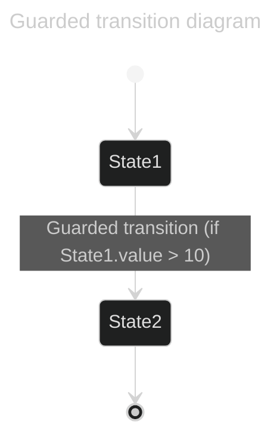
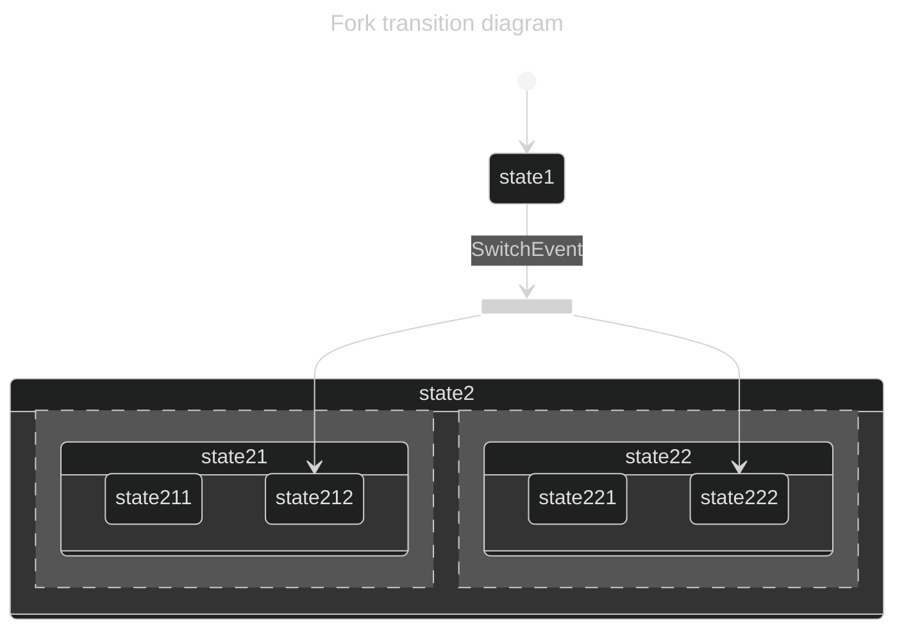
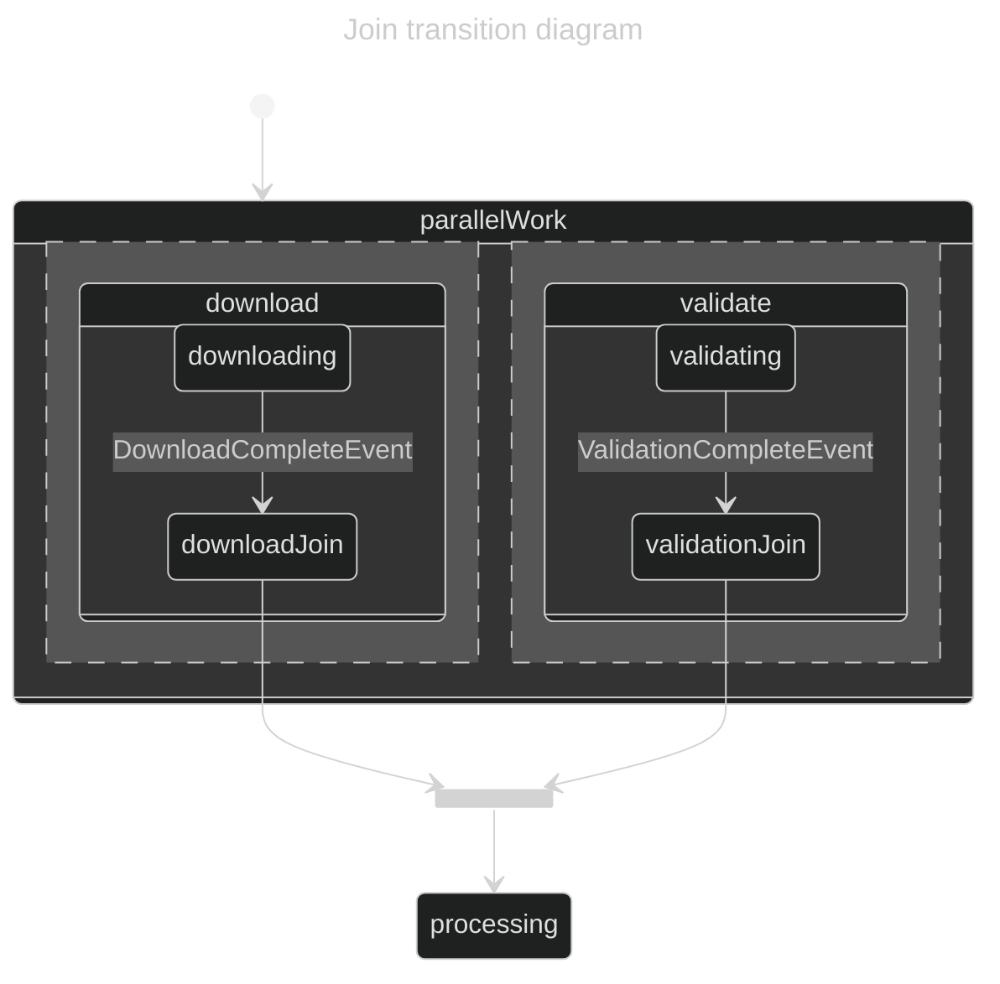
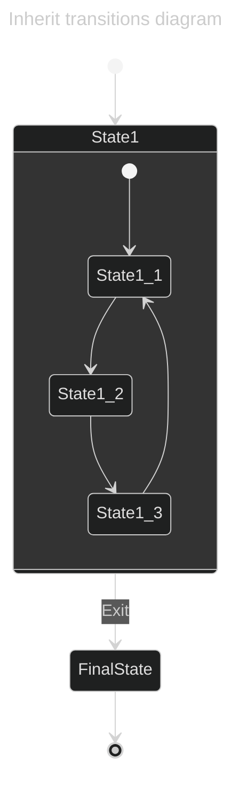

# Transitions
{: .no_toc }

## Page contents
{: .no_toc .text-delta }

- TOC
{:toc}

In a state setup block we define which events trigger transitions. The library offers several
transition methods that escalate in flexibility — pick the **simplest form that fits your need**,
and move down the table only when the simpler form cannot express it.

## Choosing the right transition API

### By API complexity

Each row is strictly more flexible than the one above it. Start at the top and move down only when
the simpler form cannot express what you need:

| When you need…                                                                                                                                                                             | API                                                |
|--------------------------------------------------------------------------------------------------------------------------------------------------------------------------------------------|----------------------------------------------------|
| **Target state already declared, no guard.** Shortest form.                                                                                                                                | `transition<E>("name", targetState)`               |
| **Guard or side calculations** in a scoped block. Listeners (`onTriggered`, `onComplete`) attached here.                                                                                   | `transition<E> { guard = … ; targetState = … }`    |
| **Guard and dynamic / lazy target** picked at fire time. Lets you reference `lateinit` states.                                                                                             | `transitionOn<E> { targetState = { … } }`          |
| **Transition direction** fully controled by one `direction` lambda. Required for multi-target forks. Also the only way to bypass type-safety to target a `DataState` from a plain `Event`. | `transitionConditionally<E> { direction = { … } }` |

### By trigger family

| Family                   | Trigger / purpose                                                                                                                                                                                                                                                |
|--------------------------|------------------------------------------------------------------------------------------------------------------------------------------------------------------------------------------------------------------------------------------------------------------|
| `transition*`            | The common API — fires when the matching `Event` arrives. Every other family below inherits the same four-step ladder from [the table above](#by-api-complexity).                                                                                                |
| `dataTransition*`        | Type-safe analog of `transition*`: enforces at compile time that the `DataEvent` carries data of the type the target `DataState` expects. See [Typesafe transitions](https://kstatemachine.github.io/kstatemachine/pages/transitions/typesafe_transitions.html). |
| `autoTransition*`        | Fires on source-state entry, no explicit event required (UML eventless / "always").                                                                                                                                                                              |
| `joinTransition*`        | Fires when all join-point states inside a parallel state are simultaneously active (UML join).                                                                                                                                                                   |
| `delayedAutoTransition*` | Fires after a configured delay while the source state is active (UML time event).                                                                                                                                                                                |

Every `*Transition*` family also has a `*DataTransition*` analog (`autoDataTransition*`,
`joinDataTransition*`, `delayedAutoDataTransition*`) that keeps the same compile-time
`DataEvent → DataState` type-safety.

Listening to transition firing is uniform across all families — see [Listen to all transitions in one place](#listen-to-all-transitions-in-one-place).

## Target-less transitions

Transition may have no target state (`targetState` is null) which means that state machine stays in current state when
such transition triggers, it is useful to perform some actions without changing current state:

```kotlin
greenState {
    transition<YellowEvent> {
        onTriggered { /* ... */ }
    }
}
```

{: .note }
Such transitions are also called internal or self-targeted.

## Transition type

There are two types of transitions `TransitionType.LOCAL` (default) and `TransitionType.EXTERNAL`.
Most transitions are functionally equivalent regardless of type, except when transitioning between a superstate and a
sub-state.
A local transition does not cause an exit and re-entry of the source state when the target is a sub-state of the source,
and does not cause an exit and re-entry of the target state when the target is a superstate of the source.

Use `type` argument or property of transition builder functions to set transition type:

```kotlin
transition<SwitchEvent> {
    type = EXTERNAL
    targetState = state2
}
```

## Check if the transition is triggered by StartEvent

When you start a StateMachine it enters it's initial state path. This is done with special
library defined event called `StartEvent`.

Sample: There are use cases when you need to check if the state is activated by StateMachine initialization
or due to some event processing in machine runtime (after initialization).

It can be done by checking the event type in `TransitionParams`, if it is `StartEvent` or not.
The library provides convenience `TransitionParams::isStartTransition` extension property for that purpose:

```kotlin
val machine = createStateMachine(scope) {
    val state1 = initialState("state1") {
        // will be triggered twice,
        // first time on initialization and the second after SwitchEvent processing
        onEntry {
            // true - if entering by StateMachine initialization (StartEvent)
            // false - if entering any other way, by SwitchEvent in this case.
            println(it.isStartTransition)
        }
        transitionOn<SwitchEvent> { targetState = { state2 } }
    }
    val state2 = state("state2") {
        transitionOn<SwitchEvent> { targetState = { state1 } }
    }
}
machine.processEvent(SwitchEvent)
machine.processEvent(SwitchEvent)
```

You can also access the `StartEvent` directly to read which state the machine entered:

```kotlin
onEntry {
    val startEvent = it.event as? StartEvent
    println("Initial state: ${startEvent?.startState}")
}
```

## Listen to all transitions in one place

There might be many transitions from one state to another. It is possible to listen to all of them in state machine
setup block:

```kotlin
createStateMachine(scope) {
    // ...
    onTransitionTriggered {
        // Listen to all triggered transitions here
        println(it.event)
    }
    onTransitionComplete { activeStates, transitionParams ->
        // Called after target state entry callbacks have run
        println("Active states: $activeStates")
    }
}
```

Per-transition listeners also support both callbacks via `onTriggered {}` and `onComplete {}` extension functions:

```kotlin
transition<SwitchEvent> {
    targetState = state2
    onTriggered { println("Triggered by ${it.event}") }
    onComplete { activeStates, transitionParams ->
        // Called after state2's onEntry callbacks have run
        println("Now in: $activeStates")
    }
}
```

`onTriggered` fires before target state entry callbacks; `onComplete` fires after all entry callbacks of the target
state (and its children) have completed.

## Guarded transitions

A `guard` is a suspending lambda evaluated at fire time; if it returns `false` the transition does
not fire and the source state stays put.

```kotlin
state1 {
    transition<SwitchEvent> {
        guard = { value > 10 }
        targetState = state2
        // ...
    }
}
```

When the target state itself depends on runtime data (routing to one of several states), reach
for `transitionConditionally` and return `noTransition()` from `direction` to block instead.

See [guarded transition sample](https://github.com/KStateMachine/kstatemachine/tree/master/samples/src/commonMain/kotlin/ru/nsk/samples/GuardedTransitionSample.kt)


```mermaid
---
title: Guarded transition diagram
---
%%{init: {'theme': 'dark'}}%%
stateDiagram-v2
State1 
[*] --> State1
State1 --> State2 : Guarded transition (if State1.value > 10)
State2 --> [*]
```

## Conditional transitions

State machine becomes more powerful tool when you can choose target state depending on your business logic (some
external data). Conditional transitions give you maximum flexibility on choosing target state and conditions when
transition is triggered.

There are following options to choose transition direction:

* `stay()` - transition is triggered but state is not changed (target-less transition analog);
* `targetState(nextState)` - transition is triggered and state machine goes to the specified state;
* `targetParallelStates(nextState1, nextState2)` transition is triggered and state machine goes to the specified
  paralleled states see [Transition targeting multiple states](#transition-targeting-multiple-states-fork);
* `noTransition()` - transition is not triggered.

Use `transitionConditionally()` function to create conditional transition and specify a function which makes desired
decision:

```kotlin
// Suppose you have a function returning some 
// business logic value which may differ
fun getCondition() = 0

redState {
    // A conditional transition helps to control when it 
    // should be triggered and determine its target state
    transitionConditionally<GreenEvent> {
        direction = {
            when (getCondition()) {
                0 -> targetState(greenState)
                1 -> targetState(yellowState)
                2 -> targetParallelStates(parallelState1, parallelState2)
                3 -> stay()
                else -> noTransition()
            }
        }
    }
    // Same as before you can listen when conditional transition is triggered
    onTriggered { println("Conditional transition is triggered") }
}
```

## Transition targeting multiple states (fork)

`targetParallelStates()` is the programmatic equivalent of a **UML fork pseudo-state**: a single transition
splits control into several concurrent orthogonal regions, activating one target state per region simultaneously.

Use it inside `transitionConditionally()` when you want to enter a parallel state and place each of its orthogonal
regions into a specific sub-state rather than letting them start from their default initial states.
Each specified target must be a descendant (not necessarily a direct child) of
a [parallel state](../states/states.md#parallel-states).

```kotlin
initialState("state1") {
    transitionConditionally<SwitchEvent> {
        direction = { targetParallelStates(state212, state222) }
    }
}
state("state2", childMode = ChildMode.PARALLEL) {
    state("state21") {
        initialState("state211")
        state212 = state("state212")
    }
    state("state22") {
        initialState("state221")
        state222 = state("state222")
    }
}
```


```mermaid
---
title: Fork transition diagram
---
%%{init: {'theme': 'dark'}}%%
stateDiagram-v2
state fork_state <<fork>>
state state2 {
  state state21 {
    state211
    state212
  }
  --
  state state22 {
    state221
    state222
  }
}
[*] --> state1
state1 --> fork_state : SwitchEvent
fork_state --> state212
fork_state --> state222
```

[PseudoState](https://kstatemachine.github.io/kstatemachine/pages/states/states.html#pseudo-states) targets (choice,
history, etc.) are accepted and resolved
transparently at runtime, so you can pass a choice state as one of the fork targets and it will be followed to
its effective destination before activation.

## Synchronizing parallel regions (join)

The `joinTransition*` family is the programmatic equivalent of a **UML join pseudo-state**: multiple
orthogonal regions each transition to a dedicated join-point state inside that region, and when
**all** join-point states are simultaneously active the single outgoing transition fires
automatically.

Call `joinTransition()` on the **parallel state** inside its DSL block, passing one join-point state per region and
the target state to enter after joining.

```kotlin
state("parallelWork", childMode = ChildMode.PARALLEL) {

    state("download") {
        val downloadJoin = state("downloadJoin")  // no outgoing transitions → soft-blocks
        initialState("downloading") {
            transition<DownloadCompleteEvent> { targetState = downloadJoin }
        }
    }

    state("validate") {
        val validationJoin = state("validationJoin")
        initialState("validating") {
            transition<ValidationCompleteEvent> { targetState = validationJoin }
        }
    }

    joinTransition(downloadJoin, validationJoin, targetState = processing)
}
```


```mermaid
---
title: Join transition diagram
---
%%{init: {'theme': 'dark'}}%%
stateDiagram-v2
state join_state <<join>>
state parallelWork {
  state download {
    downloading --> downloadJoin : DownloadCompleteEvent
  }
  --
  state validate {
    validating --> validationJoin : ValidationCompleteEvent
  }
}
downloadJoin --> join_state
validationJoin --> join_state
join_state --> processing
[*] --> parallelWork
```

**Soft blocking**: once a region enters its join-point state, the parallel state's event-routing algorithm finds no
matching transition there and falls back to the parallel parent's own transitions — which only contain the internal
`JoinCompleteEvent`. All other events find no match and are silently ignored for that region. This is
convention-based: join-point states **must not** have outgoing user transitions.

**`FinalState` alternative**: if every region should also mark itself *finished*, use `finalState()` instead of a
plain join-point state. The parallel parent then fires `FinishedEvent` when all regions finish, giving two
notification paths for the same condition.

### Joining into a DataState

There is no event carrying data through a join, so the `DataState` variants take a `dataProducer`
lambda instead. It is called once, at join time, to compute the value the target
[`DataState`](https://kstatemachine.github.io/kstatemachine/pages/states/states.html#data-states) receives on entry.

```kotlin
val result: DataState<String> = dataState("result")

state("parallelWork", childMode = ChildMode.PARALLEL) {

    state("download") {
        val downloadJoin = state("downloadJoin")
        initialState("downloading") {
            transition<DownloadCompleteEvent> { targetState = downloadJoin }
        }
    }

    state("validate") {
        val validationJoin = state("validationJoin")
        initialState("validating") {
            transition<ValidationCompleteEvent> { targetState = validationJoin }
        }
    }

    joinDataTransition {
        joinStates = setOf(downloadJoin, validationJoin)
        targetState = result
        dataProducer = { "download + validation complete" }
    }
}
```

The lambda runs inside the same coroutine that processes the join, so it may suspend (e.g. perform an async read).
Once the lambda returns, the library fires an internal `DataJoinCompleteEvent` carrying the produced value;
`result.data` is set from it exactly as if the trigger had been a regular `DataEvent`.

## Eventless (automatic) transitions

The `autoTransition*` family is a **UML eventless ("always") transition** — it fires on state
entry, without any external event. After it lands in its target state, that state's own eventless
transitions (if any) are evaluated in turn, producing UML run-to-completion semantics. Guards are
evaluated at fire time; if a guard rejects the state simply stays put and the transition is
re-tried on the next entry.

```kotlin
val target = state("target")
initialState("source") {
    autoTransition(targetState = target)            // fires on entry of "source"
}
```

Internally, the library wires an `onEntry` listener on the source state that emits an internal `AutoEvent`; the regular
event-dispatch loop picks it up through a dedicated matcher and runs the transition just like any other. This is the
same building block `joinTransition` uses, so chained eventless transitions, guards, and the `QueuePendingEventHandler`
all behave exactly as for normal events.

{: .note }
Watch out for cycles: a chain of always-true guarded eventless transitions that returns to the same state will produce
an unbounded event loop. Guards must eventually reject (or the chain must terminate in a state with no eventless
transition out).

### Eventless transition into a DataState

For `DataState` targets, the `dataProducer` lambda runs once at fire time and its return value is
delivered to the target as its entry data — no custom `DataEvent` subclass is needed.

```kotlin
val session: DataState<LoginResult> = dataState<LoginResult>("session")
initialState("authenticating") {
    autoDataTransition(targetState = session) {
        LoginResult(userId = "u-42", sessionToken = "abc123")
    }
}
```

See full runnable examples in
[
`AutoTransitionSample.kt`](https://github.com/KStateMachine/kstatemachine/blob/master/samples/src/commonMain/kotlin/ru/nsk/samples/AutoTransitionSample.kt)
and
[
`AutoDataTransitionSample.kt`](https://github.com/KStateMachine/kstatemachine/blob/master/samples/src/commonMain/kotlin/ru/nsk/samples/AutoDataTransitionSample.kt).

## Delayed auto transitions

A delayed transition is a **UML time-event ("after Xms") transition**. It reuses [`AutoEvent`](#eventless-automatic-transitions)
under the hood — semantically just an auto-transition whose firing is postponed by a timer.
The timer starts when the source state is entered, fires after the configured delay, and is
automatically cancelled when the state is exited or when the machine is stopped or destroyed.
On re-entry the timer restarts from zero. If a `guard` is supplied and rejects at fire time, the
state stays put — the timer does **not** auto-restart (it fires again only on the next entry).

The `delayedAutoTransition*` family offers the same four-step ladder as
[the selection table](#by-api-complexity). Pick the simplest form that fits:

```kotlin
// Shortcut: delay is a function argument
initialState("splash") {
    delayedAutoTransition(delay = 2.seconds, targetState = home)
}

// Scoped: delay is a DSL field on the builder, set inside the lambda
initialState("splash") {
    delayedAutoTransition {
        delay = 2.seconds
        guard = { ready }
        targetState = home
    }
}

// Lazy / dynamic target
delayedAutoTransitionOn {
    delay = 30.seconds
    targetState = { screensaver }
}

// Full direction control
delayedAutoTransitionConditionally {
    delay = 1.seconds
    direction = { if (busy) noTransition() else targetState(next) }
}
```

{: .note }
For the scoped, `*On`, and `*Conditionally` variants the delay is **always** set inside the builder
lambda (`delay = …`), not as a function argument. `delay` is a required field and the builder throws
at setup time if it is left unset. ([`Duration`](https://kotlinlang.org/api/core/kotlin-stdlib/kotlin.time/-duration/)
is an inline value class, so `lateinit` is not available — the field is nullable and validated on `build()`.)

Lives in `kstatemachine-coroutines` because it needs a `CoroutineScope` to host the timer. Calling
it on a machine created with `createStdLibStateMachine` throws — use `createStateMachine(scope) { ... }`
instead. The job lifecycle mirrors [`asyncScopedAction`](https://kstatemachine.github.io/kstatemachine/pages/states/states.html#async-scoped-action-do-activity):
launch on entry, cancel on exit, cancel on machine stop/destroy.

### Delayed auto transition into a DataState

`delayedAutoDataTransition*` is the type-safe variant — its `dataProducer` lambda runs once when
the timer fires (not at registration time) and its return value is delivered to the target
[`DataState`](https://kstatemachine.github.io/kstatemachine/pages/states/states.html#data-states)
as its entry data. The same scoped / `*On` ladder applies:

```kotlin
// Shortcut
initialState("waiting") {
    delayedAutoDataTransition(delay = 5.seconds, targetState = timedOut) {
        "no user response within 5s"
    }
}

// Scoped — delay and dataProducer both via DSL
delayedAutoDataTransition<String> {
    delay = 5.seconds
    targetState = timedOut
    dataProducer = { "no user response within 5s" }
}

// Lazy target
delayedAutoDataTransitionOn<Int> {
    delay = 1.seconds
    targetState = { counter }
    dataProducer = { computeNext() }
}
```

A self-targeted form is available when the surrounding state is itself a `DataState<D>` (i.e.
inside a `DataTransitionStateApi<D>` block), in which case `targetState` is omitted and the
producer refreshes the current state's data.

See full runnable examples in
[`DelayedAutoTransitionSample.kt`](https://github.com/KStateMachine/kstatemachine/blob/master/samples/src/commonMain/kotlin/ru/nsk/samples/DelayedAutoTransitionSample.kt)
and
[`DelayedAutoDataTransitionSample.kt`](https://github.com/KStateMachine/kstatemachine/blob/master/samples/src/commonMain/kotlin/ru/nsk/samples/DelayedAutoDataTransitionSample.kt).

## Transition interruption

Return `false` from a [`guard`](#guarded-transitions), or `noTransition()` from a
`transitionConditionally` [`direction`](#conditional-transitions), to block the transition from
firing. Both lambdas are `suspend`, so they can call coroutines directly.

```kotlin
transitionConditionally<SwitchEvent> {
    direction = {
        if (should) targetState(nextState) else noTransition()
    }
}
```

There is no way to interrupt a transition from `onTriggered()` notifications.

## Transition event type matching

By default the event type is matched with `isInstanceOf()`: the transition fires for the specified class
**and all its subclasses**.

```kotlin
// Fires for SwitchEvent and any class that extends SwitchEvent
transition<SwitchEvent>()
```

### Catch-all (wildcard) transitions

Because `Event` is the base class of every event in the library, `transition<Event>()` matches **any** event:

```kotlin
state("fallback") {
    // triggered by every event that reaches this state
    transition<Event> { targetState = errorState }
}
```

This is the standard pattern for a wildcard or default transition — it is also commonly used to override a
parent transition for all events (see [Transition override rules](#transition-override-rules)).

### Strict matching

Use `isEqual()` to match only the exact class, ignoring subclasses:

```kotlin
transition<SwitchEvent> {
    eventMatcher = isEqual()   // only SwitchEvent, not subclasses
}
```

### Custom matchers

Implement `EventMatcher` to apply any predicate:

```kotlin
transition<SwitchEvent> {
    eventMatcher = object : EventMatcher<SwitchEvent>(SwitchEvent::class) {
        override suspend fun match(eventAndArgument: EventAndArgument<*>) =
            eventAndArgument.event is SwitchEvent && someCondition()
    }
}
```

| Matcher          | Matches                              |
|------------------|--------------------------------------|
| `isInstanceOf()` | The type and every subtype (default) |
| `isEqual()`      | Only the exact type, no subtypes     |
| Custom           | Any logic you need                   |

## Finding transitions

Use `findTransition()` / `requireTransition()` to look up a transition on any state after the machine is built, for
example to attach a listener dynamically.

**By name:**

```kotlin
val t = state.requireTransition("myTransition")
```

**By event type (strict):**

```kotlin
// finds only the transition whose eventClass is exactly SwitchEvent
val t = state.findTransition<SwitchEvent>()
```

**By event instance (suspend):**

```kotlin
// calls eventMatcher.match(event) — respects all custom matcher logic
val t = state.findTransition(myEvent)
```

This overload is `suspend` because `EventMatcher.match` is itself suspending. It honours the full matcher
contract, so a transition with a custom `finishedEventMatcher` or `isEqual()` will only be returned when
its matcher actually accepts the provided event instance.

## Undo transitions

Transitions may be undone with `StateMachine.undo()` function or alternatively by sending special `UndoEvent` to machine
like this `machine.processEvent(UndoEvent)`. State Machine will roll back last transition which is usually is switching
to previous state (except target-less transitions).
This API might be called as many times as needed.
To implement this feature library stores transitions in a stack, it takes memory,
so this feature is disabled by default and must be enabled explicitly using
`createStateMachine(creationArguments = buildCreationArguments { isUndoEnabled = true })` argument.
Other words this feature works like stack based FSM.

Undo functionality is implemented as `Event`, so it possible to call `undo()` from notification callbacks, if you use
`QueuePendingEventHandler` (which is default) or its analog.

For example if states of state machine represent UI screens, `undo()` acts like some kind of `navigateUp()` function.

Internally every `UndoEvent` is transformed to `WrappedEvent` which stores original event and argument.
When some state is entered as a result of undo operation you can access original event and argument with
`unwrappedEvent` and `unwrappedArgument` extension properties of `TransitionParams` class.
Original event is the event that triggered original transition to this state.

```kotlin
state {
    onEntry { transitionParams -> // when called as result of undo() operation
        transitionParams.event // is WrappedEvent
        transitionParams.unwrappedEvent // is original event
        (transitionParams.event as WrappedEvent).event // same as using unwrappedEvent extension
    }
}
```

See [undo transition sample](https://github.com/KStateMachine/kstatemachine/tree/master/samples/src/commonMain/kotlin/ru/nsk/samples/UndoTransitionSample.kt)

## Cross-level transitions

A transition can have any state as its target. This means that the target state does not have to be on the same level in
the state hierarchy as the source state.


## Transition argument

If transition listener produce some data, you can pass it to target state as a transition argument:

```kotlin
val second = state("second").onEntry {
    println("Transition argument: ${it.transition.argument}")
}
state("first") {
    transition<SwitchEvent> {
        targetState = second
        onTriggered { it.transition.argument = 42 }
    }
}
```

{: .note }
It is up to user to control that argument field is set from one listener. You can use some mutable data structure
and fill it from multiple listeners.

## Inherit transitions by grouping states

Suppose you have three states that all should have a transition to another state. Defining it on each state
individually is repetitive and error-prone when states are added later. The solution is to define the
transition on a parent state — all child states **inherit** it automatically.


```mermaid
---
title: Inherit transitions diagram
---
%%{init: {'theme': 'dark'}}%%
stateDiagram-v2
state State1 {    
    [*] --> State1_1
    State1_1 --> State1_2
    State1_2 --> State1_3
    State1_3 --> State1_1
}

[*] --> State1
State1 --> FinalState : Exit
FinalState --> [*]
```

```kotlin
createStateMachine(scope) {
    val finalState = finalState("final")

    // All children of this state inherit the Exit transition
    initialState("state1", childMode = ChildMode.EXCLUSIVE) {
        transition<ExitEvent> { targetState = finalState }

        initialState("state1_1") { /* inherits ExitEvent transition */ }
        state("state1_2") { /* inherits ExitEvent transition */ }
        state("state1_3") { /* inherits ExitEvent transition */ }
    }
}
```

### Transition lookup order

When an event arrives, the machine searches for a matching transition starting at the **currently active
(leaf) state** and walking up the parent chain until a match is found or the root is reached:

1. Active leaf state — own transitions checked first
2. Parent state — its transitions checked next
3. Grandparent, … up to the root machine state

The first matching transition wins. If no transition matches anywhere in the chain, the event is passed to
`IgnoredEventHandler`.

### Transition override rules

A child state **overrides** an inherited transition by defining its own transition that matches the same
event type. Because the default matcher is `isInstanceOf()`, a child transition registered for a supertype
also overrides parent transitions for all subtypes of that supertype.

```kotlin
createStateMachine(scope) {
    val state2 = state("state2")
    val state3 = state("state3")

    initialState("parent") {
        // Inherited by all children: SwitchEvent → state2
        transition<SwitchEvent> { targetState = state2 }

        // This child handles SwitchEvent itself → overrides the parent transition
        initialState("child1") {
            transition<SwitchEvent> { targetState = state3 }
        }

        // This child has no SwitchEvent transition → inherits parent's (→ state2)
        state("child2")
    }
}
```

### Wildcard override — block all inherited transitions

Use `transition<Event>()` on a child state to intercept **every** event before it can reach the parent.
This works because `Event` is the base class of all events and `isInstanceOf()` matches every subtype:

```kotlin
createStateMachine(scope) {
    val state2 = state("state2")

    initialState("parent") {
        transition<SwitchEvent> { targetState = state2 }

        // This child absorbs all events; the parent transition is never reached
        initialState("child") {
            transition<Event>()   // target-less: stay in child, consume the event
        }
    }
}
```

### Transition priority within the same state

By default the library **throws an exception** if more than one transition on the same state matches the
incoming event. This is a safety net that catches ambiguous machine definitions early.

```kotlin
state {
    // Both could match a SwitchEvent subtype — throws by default
    transition<SwitchEvent>()
    transition<Event>()
}
```

To opt into first-match-wins semantics (declaration order) instead of throwing, set
`doNotThrowOnMultipleTransitionsMatch = true` in the creation arguments:

```kotlin
val machine = createStateMachine(
    scope,
    creationArguments = buildCreationArguments {
        doNotThrowOnMultipleTransitionsMatch = true
    }
) {
    state {
        transition<SpecificEvent> { targetState = state1 }   // wins for SpecificEvent
        transition<Event> { targetState = fallback }  // wins for everything else
    }
}
```

With `doNotThrowOnMultipleTransitionsMatch = true` the first matching transition in declaration order is
selected, so define more specific transitions before more general catch-all ones.