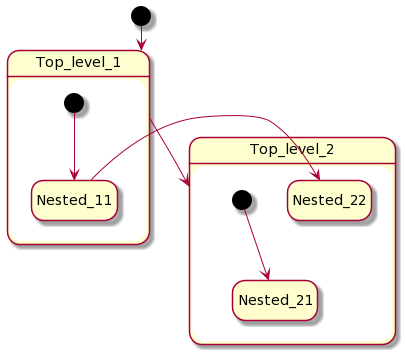

# Transitions
{: .no_toc }

## Page contents
{: .no_toc .text-delta }

- TOC
{:toc}

In a state setup block we define which events will trigger transitions to another states. The simplest transition is
created with `transition()` function:

```kotlin
greenState {
    // Setup transition which is triggered on YellowEvent
    transition<YellowEvent> {
        // Set target state where state machine go when this transition is triggered
        targetState = yellowState
    }
    // The same with shortcut version
    transition<RedEvent>("My transition", redState)
}
```

Same as for states we can listen to transition triggering:

```kotlin
transition<YellowEvent> {
    targetState = yellowState
    onTriggered { println("Transition to $targetState is triggered by ${it.event}") }
}
```

There is an extended version of `transition()` function, it is called `transitionOn()`. It works the same way but takes
a lambda to calculate target state. This allows to use `lateinit` state variables and to choose target state depending
on an application business logic like with [conditional transitions](#conditional-transitions) but with shorter syntax
and less flexibility:

```kotlin
createStateMachine(scope) {
    lateinit var yellowState: State

    greenState {
        transitionOn<YellowEvent> {
            targetState = { yellowState }
        }
    }

    yellowState = state {
        // ...
    }
}
```

## Target-less transitions

Transition may have no target state (`targetState` is null) which means that state machine stays in current state when
such transition triggers, it is useful to perform some actions without changing current state:

```kotlin
greenState {
    transition<YellowEvent> {
        onTriggered { /* ... */ }
    }
}
```

{: .note }
Such transitions are also called internal or self-targeted.

## Transition type

There are two types of transitions `TransitionType.LOCAL` (default) and `TransitionType.EXTERNAL`.
Most of the cases both transitions are functionally equivalent except in cases where transition
is happening between super and sub states. Local transition doesn't cause exit and entry to source state if
target state is a sub-state of a source state.
Local transition doesn't cause exit and entry to target state if target is a superstate of a source
state.

Use `type` argument or property of transition builder functions to set transition type:

```kotlin
transition<SwitchEvent> {
    type = EXTERNAL
    targetState = state2
}
```

## Listen to all transitions in one place

There might be many transitions from one state to another. It is possible to listen to all of them in state machine
setup block:

```kotlin
createStateMachine(scope) {
    // ...
    onTransitionTriggered {
        // Listen to all triggered transitions here
        println(it.event)
    }
}
```

## Guarded transitions

Guarded transition is triggered only if specified guard function returns `true`. Guarded transition is a special kind
of [conditional transition](#conditional-transitions) with shorter syntax. Use `transition()` or `transitionOn()`
functions to create guarded transition:

```kotlin
state1 {
    transition<SwitchEvent> {
        guard = { value > 10 }
        targetState = state2
        // ...
    }
}
```

See [guarded transition sample](https://github.com/nsk90/kstatemachine/tree/master/samples/src/commonMain/kotlin/ru/nsk/samples/GuardedTransitionSample.kt)


## Conditional transitions

State machine becomes more powerful tool when you can choose target state depending on your business logic (some
external data). Conditional transitions give you maximum flexibility on choosing target state and conditions when
transition is triggered.

There are fallowing options to choose transition direction:

* `stay()` - transition is triggered but state is not changed;
* `targetState(nextState)` - transition is triggered and state machine goes to the specified state;
* `targetParallelStates(nextState1, nextState2)` transition is triggered and state machine goes to the specified
  paralleled states see [Transition targeting multiple states](#transition-targeting-multiple-states);
* `noTransition()` - transition is not triggered.

Use `transitionConditionally()` function to create conditional transition and specify a function which makes desired
decision:

```kotlin
// Suppose you have a function returning some 
// business logic value which may differ
fun getCondition() = 0

redState {
    // A conditional transition helps to control when it 
    // should be triggered and determine its target state
    transitionConditionally<GreenEvent> {
        direction = {
            when (getCondition()) {
                0 -> targetState(greenState)
                1 -> targetState(yellowState)
                2 -> targetParallelStates(parallelState1, parallelState2)
                3 -> stay()
                else -> noTransition()
            }
        }
    }
    // Same as before you can listen when conditional transition is triggered
    onTriggered { println("Conditional transition is triggered") }
}
```

## Transition targeting multiple states

When you work with parallel states, you may want to specify multiple states as a transition target, specifying
a target state for each parallel state region.

This may be done with `targetParallelStates()` method inside `transitionConditionally()` transition builder function.
Each specified state must be a child (not necessary direct) of a parallel state.

```kotlin
initialState("state1") {
    transitionConditionally<SwitchEvent> {
        direction = { targetParallelStates(state212, state222) }
    }
}
state("state2", childMode = ChildMode.PARALLEL) {
    state("state21") {
        initialState("state211")
        state212 = state("state212")
    }
    state("state22") {
        initialState("state221")
        state222 = state("state222")
    }
}
```

## Transition interruption

Typically, to calculate whether transition processing should be performed or not, you can use a guard function, 
described in [Guarded transitions](#guarded-transitions). In such APIs guard function is separated from `targetState`
calculation function, sometimes it might be not convenient. So if your logic requires to mix the selection of a 
`targetState` with the fact of triggering of the transition, it is more convenient to use `transitionConditionally()`
as it accepts single callback method called `direction`.

```kotlin
transitionConditionally<SwitchEvent> {
    direction = {
        if (should) 
            targetState(nextState) 
        else 
            noTransition() // transition will not be triggered at all
    }
}
```

Both `guard` and `direction` callbacks are marked with `suspend` keyword, so you can easily call coroutines in 
synchronous style inside them.

There is no way to interrupt a transition from `onTriggered()` notifications.

## Transition event type matching

By default, event type that triggers transition is matched as instance of specified event class. For
example `transition<SwitchEvent>()` matches `SwitchEvent` class and its subclasses. If you have event hierarchy it might
be necessary to control matching mechanism, it might be done with `eventMatcher` argument of transition builder
functions:

```kotlin
transition<SwitchEvent> {
    eventMatcher = isEqual()
}
```

There are two predefined event matchers:

* `isInstanceOf()` matches specified class and its subclasses (default)
* `isEqual()` matches only specified class

You can define your own matchers by subclassing `EventMatcher` class.

## Undo transitions

Transitions may be undone with `StateMachine.undo()` function or alternatively by sending special `UndoEvent` to machine
like this `machine.processEvent(UndoEvent)`. State Machine will roll back last transition which is usually is switching
to previous state (except target-less transitions).
This API might be called as many times as needed.
To implement this feature library stores transitions in a stack, it takes memory,
so this feature is disabled by default and must be enabled explicitly using
`createStateMachine(creationArguments = CreationArguments(isUndoEnabled = true))` argument.
Other words this feature works like stack based FSM.

Undo functionality is implemented as `Event`, so it possible to call `undo()` from notification callbacks, if you use
`QueuePendingEventHandler` (which is default) or its analog.

For example if states of state machine represent UI screens, `undo()` acts like some kind of `navigateUp()` function.

Internally every `UndoEvent` is transformed to `WrappedEvent` which stores original event and argument.
When some state is entered as a result of undo operation you can access original event and argument with
`unwrappedEvent` and `unwrappedArgument` extension properties of `TransitionParams` class.
Original event is the event that triggered original transition to this state.

```kotlin
state {
    onEntry { transitionParams -> // when called as result of undo() operation
        transitionParams.event // is WrappedEvent
        transitionParams.unwrappedEvent // is original event
        (transitionParams.event as WrappedEvent).event // same as using unwrappedEvent extension
    }
}
```

See [undo transition sample](https://github.com/nsk90/kstatemachine/tree/master/samples/src/commonMain/kotlin/ru/nsk/samples/UndoTransitionSample.kt)

## Cross-level transitions

A transition can have any state as its target. This means that the target state does not have to be on the same level in
the state hierarchy as the source state.



## Transition argument

If transition listener produce some data, you can pass it to target state as a transition argument:

```kotlin
val second = state("second").onEntry {
    println("Transition argument: ${it.transition.argument}")
}
state("first") {
    transition<SwitchEvent> {
        targetState = second
        onTriggered { it.transition.argument = 42 }
    }
}
```

{: .note }
It is up to user to control that argument field is set from one listener. You can use some mutable data structure
and fill it from multiple listeners.

## Inherit transitions by grouping states

Suppose you have three states that all should have a transitions to another state. You can explicitly set this
transition for each state but with this approach complexity grows and when you add fourth state you have to remember to
add this specific transition. This problem can be solved with adding parent state which defines such transition and
groups its child states. Child states inherit there parent transitions.


A child state can override an inherited transition. To override parent transition child state should define any
transition that matches the event.

```kotlin
createStateMachine(scope) {
    val state2 = state("state2")
    // all nested states inherit this parent transition
    transition<SwitchEvent> { targetState = state2 }

    // child state overrides transitions for all events
    initialState("state1") { transition<Event>() }
}
```